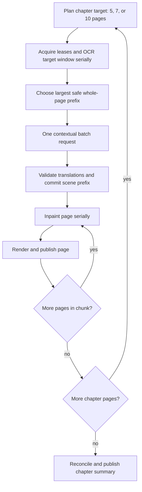

# Design

## Governing decisions

1. **Logical chunks, not streaming inactivity envelopes.** `DynamicPageChunker` supplies the chapter-size target. The chapter batch no longer uses the 250 ms inactivity flusher to define requests.
2. **OCR determines the final boundary.** OCR runs serially over the target window and persists lightweight page results. A new page-atomic envelope planner chooses the largest natural-order prefix that fits the contextual provider's page/block/token limits. OCR results beyond that prefix remain durable input for the next chunk; no bitmap is retained.
3. **One happy-path request.** The chosen chunk is submitted in one contextual batch request. Existing structural/missing-output recovery remains bounded and is the only normal reason for extra requests. A single oversized page is handled as one logical chunk with internal transport slicing as an exceptional fallback.
4. **Post-translation native phase.** Inpaint begins only after the chunk translation is validated and committed. Pages then inpaint/render serially and publish individually. The next chunk waits for every page in the current chunk to reach a terminal state.
5. **Reuse the safety model.** Generation scopes, page leases, guarded updates, artifact candidates/commits, scene-prefix validation, glossary updates, and reader attachment remain the persistence/lifecycle boundary.

## End-to-end flow

## Component changes

### Chunk planning

- Promote `DynamicPageChunker` from unused test utility into the chapter-batch path, but separate its chapter-size target from final provider-envelope selection.
- Add a page-atomic contextual boundary planner. It consumes persisted `PageTranslation` values in natural order and stops before adding a page that would exceed configured page/block/token constraints.
- Do not split a normal page across logical chunks. If the first page alone exceeds transport capacity, mark it as an exceptional one-page chunk and delegate to bounded transport slicing.
- Emit explicit diagnostics with chunk index, natural page range, page count, block count, and shrink reason.

### Coordinator

- Replace `SequentialBatchCoordinator.runPass1` for contextual chapter batches with a chunk loop whose barriers are explicit:
  1. OCR barrier.
  2. Translation barrier.
  3. Per-page inpaint/render/publish barrier.
- Keep standard/local translators on their current per-page path unless sharing the new coordinator is mechanically safe and behavior-preserving.
- Remove the contextual chapter batch's dependence on `InactivityFlusher`; it remains available only to other callers that genuinely need streaming behavior.

### Textless pages

- In `analyzePage`, set the default `inpaint=PENDING` before applying explicit textless semantics, or conditionally avoid overwriting `SKIPPED`.
- A zero-block/zero-mask page must finish as OCR ready, translation skipped, inpaint skipped, and render skipped.
- Tracker callbacks must mark the page processed/skipped, and lease release must occur after native/textless finalization rather than racing the inpaint branch.

### Translation and context

- Build one `TranslationContextChunk` from the final whole-page prefix.
- Preserve `StableBlockIds`, reading-order sorting, rolling scene card, analytical context, glossary accumulation, response validation, prefix commit, and correction invalidation.
- Do not advance trusted scene context past a failed/refused page. Finish the logical chunk as warning/failure according to existing retry exhaustion rules before considering the next chunk.

### Inpaint, render, and reader visibility

- Decode/inpaint one page at a time only after translation for the logical chunk is committed.
- Publish each cleaned image and layout through the existing guarded artifact path; notify the tracker/store immediately so an open reader can attach.
- Release the page lease at its terminal publish/failure boundary. Release remaining chunk leases on cancellation or fatal chunk exit.

## Failure and resume scenarios

| Scenario | Required behavior |
|---|---|
| Textless first page | Mark terminal textless; chunk continues; no provider item for that page. |
| Provider timeout/malformed response | Apply bounded existing retry/split policy; do not start next chunk concurrently. |
| Partial response | Commit only the valid natural prefix; retry missing output within the current chunk; never promote later context past the gap. |
| Cancellation during OCR | Persist finished OCR pages, release leases, resume from planner evidence. |
| Cancellation during provider request | Leave OCR reusable and translation non-terminal; resume the same logical frontier. |
| Cancellation during render | Keep already committed pages reader-visible; resume remaining inpaint/render pages before advancing. |
| Memory pressure | Recycle/reclaim after each native page; requeue transient work rather than turning memory deferral into permanent error. |

## Verification

- Unit-test chapter target sizes and page-atomic boundary shrinking.
- Unit-test a 67-page nominal plan and block-heavy early boundaries.
- Regression-test zero-block page 1 as terminal and non-blocking.
- Coordinator tests must prove strict stage ordering, one happy-path request per logical chunk, no next-chunk native overlap, per-page publication, cancellation cleanup, and bounded recovery.
- Pipeline tests must prove resume from OCR, translation, and partially rendered chunk checkpoints.
- Device log validation must show `chunk_start`, all chunk OCR completions, one `stage2_request`, page publish events, `chunk_complete`, then the next `chunk_start`.

