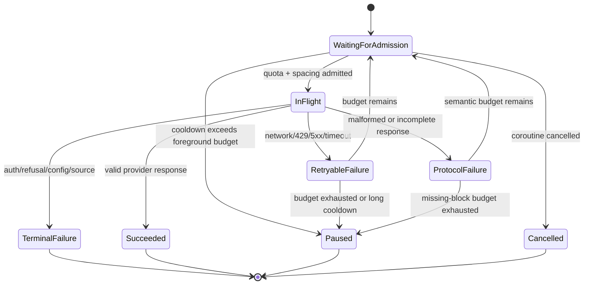
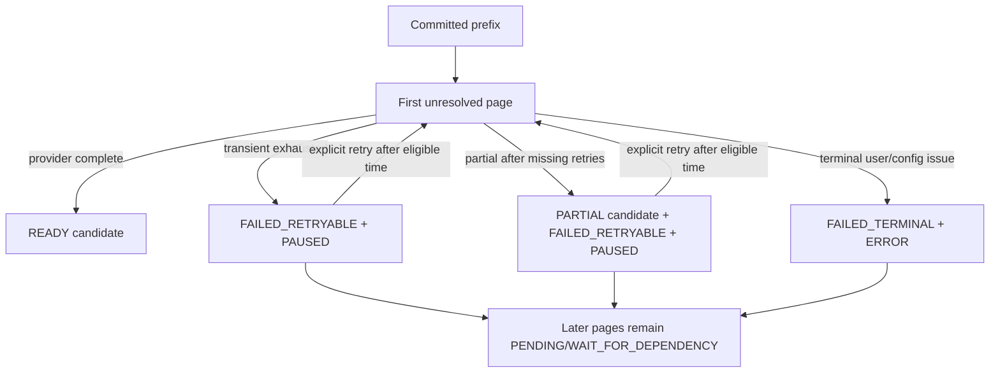

# State and contract companion

This companion makes the pause/retry semantics precise enough for the
implementation tickets. It complements
[the technical plan](shared-pacing-retry-technical-plan.md); it is not a source
schema change.

## Remote request lifecycle



The governor owns only admission and cooldown. The retry controller owns the
finite budget and response validation. The pipeline owns durable page and
chapter state.

Admission priority is a scheduling hint, not a second lane:

```kotlin
enum class AdmissionPriority { INTERACTIVE, BACKGROUND }
```

Interactive reader requests may be selected ahead of a waiting background
request at an admission boundary, subject to a maximum age for the background
waiter. Both consume the same provider/model/credential bucket and observe the
same cooldown.

## Semantic envelope result

The implementation should expose an equivalent sealed result, with names free
to change:

```kotlin
sealed interface AiChunkOutcome {
    val acceptedBlockIds: Set<String>
    val completedPageKeys: Set<String>

    data class Complete(
        override val acceptedBlockIds: Set<String>,
        override val completedPageKeys: Set<String>,
        val blockTranslations: Map<String, String>,
        val rollingContextDelta: String,
    ) : AiChunkOutcome

    data class Paused(
        override val acceptedBlockIds: Set<String>,
        override val completedPageKeys: Set<String>,
        val missingBlockIds: Set<String>,
        val failure: ProviderFailure,
        val nextEligibleRetryAtEpochMs: Long?,
        val partialCandidate: Boolean,
    ) : AiChunkOutcome

    data class Terminal(
        override val acceptedBlockIds: Set<String>,
        override val completedPageKeys: Set<String>,
        val failure: ProviderFailure,
    ) : AiChunkOutcome
}
```

`completedPageKeys` means every non-empty source block in that page has a
validated translation. A page with any missing block is not complete even if it
has accepted translations. `rollingContextDelta` is produced only by
`Complete`; a paused/partial result must not alter the ordered context frontier.

For a multi-page result, `completedPageKeys` is projected as the natural-order
prefix ending immediately before the first incomplete page. A later page that
looks complete in the provider response remains provisional until the anchor
is complete on a later run.

## Page/chapter projections



Rules:

- Only the first unresolved ordered page may advance the context frontier.
- A retryable page owns the pause. The tail has no synthetic durable failure.
- A terminal page may require user action, but it still does not justify
  force-failing the tail.
- `FAILED_RETRYABLE` and `PARTIAL` are separate facts: the former controls
  eligibility; the latter describes retained but non-authoritative payload.
- A valid prior committed display remains the display source while a new
  candidate is partial or retryable.
- A retryable pause is data returned by the coordinator, not a swallowed
  exception or a raw `CancellationException`. The coordinator must close all
  render/translation gates and release leases, then return before ordinary
  stranded-page reconciliation can manufacture tail failures.

## Durable metadata mapping

Use the existing `DurableFailureMetadata` fields:

| Event | `status` | `category` | `nextEligibleRetryAtEpochMs` | Live chapter projection |
| --- | --- | --- | --- | --- |
| Rate limit/network budget exhausted | `FAILED_RETRYABLE` | `TRANSIENT` | Governor/server timestamp or bounded backoff timestamp | `PAUSED` |
| Missing blocks after semantic budget | `FAILED_RETRYABLE` | `TRANSIENT` or `PROTOCOL` according to classifier | Next explicit retry time | `PAUSED` |
| Provider content refusal | `FAILED_TERMINAL` | `PROVIDER_REFUSAL` | null | `ERROR` |
| Bad credentials/configuration | `FAILED_TERMINAL` | `CONFIGURATION` | null | `ERROR` |
| Source/fingerprint mismatch | `FAILED_TERMINAL` | `SOURCE` | null | `ERROR` |
| Invalid response format after bounded recovery | `FAILED_TERMINAL` only if the classifier proves user/config action is needed; otherwise retryable | `PROTOCOL` | According to result | `PAUSED` or `ERROR` |

The `failureFingerprint` must identify the relevant provider/config/source
version without containing secrets. A changed configuration or source can make
an earlier terminal failure eligible for an explicit new attempt, following
the existing artifact lifecycle rules.

If `missingBlockIds` is persisted, it is advisory resume data only. The planner
must recalculate eligibility from the current source/configuration fingerprints
and stable block IDs before issuing a targeted request; it must never trust a
stale ID after OCR or source bytes change.

## Resume contract

1. User selects Start/Retry. The manager atomically changes the in-memory item
   from `PAUSED` to active queue state, unless the cooldown has not expired and
   force was not selected.
2. The planner loads the artifact and live page snapshots. It reuses valid
   detection/OCR/inpaint and selects the first retryable translation anchor.
3. The pipeline clears only transient running markers and starts a new
   generation/precondition. It does not erase the committed prefix.
4. A successful complete page clears/supersedes its durable failure before the
   next ordered page is admitted.
5. A second pause updates the same page/stage failure metadata with incremented
   retry count and a new eligibility timestamp. The tail remains untouched.
