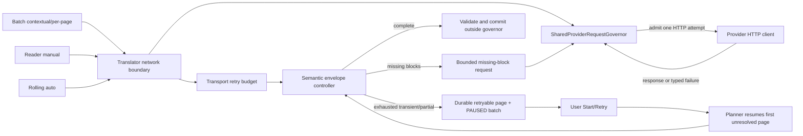

# Shared pacing and retry redesign

Status: proposed technical plan. This document authorizes no source changes in
T903; implementation should begin in a follow-up ticket after the Director
approves the direction.

## Decision summary

| Decision | Chosen behavior | Why |
| --- | --- | --- |
| Admission scope | One process-wide governor is the only entry point for every remote translation call: batch, reader manual, and rolling auto. Quota buckets are keyed by provider/model/credential scope so unrelated providers do not consume one another's quota. | The current mutex is shared in name but reader contextual calls bypass it, and it does not account for RPM, TPM, or server cooldown. |
| Admission granularity | Admit each actual HTTP attempt, with a bounded in-flight permit. Keep the permit across the network operation, but never across OCR, rendering, glossary, or artifact I/O. | A retry is a new quota-consuming request. Holding the old broad lock across local work turns pacing into a pipeline stall. |
| Retry layers | Keep a small transport retry budget and add a separate, bounded semantic envelope retry. Missing blocks are retried by stable block ID in a smaller request. A single shared budget prevents multiplicative retry storms. | The current `withTranslationRetry` retries transport failures only; `AiTranslationRetryController` plans missing-block work but never sends it. |
| Exhaustion | A transient/rate-limit/quota failure that outlives its budget pauses the batch. Completed prefix remains readable; the failed page is retryable; the later tail remains pending and is never stamped failed merely because its predecessor failed. | Ordered context cannot safely continue across the failed page, but tail failure is misleading and currently poisons resume. |
| Partial response | Retry the missing stable block IDs within the semantic budget. If still incomplete, retain a non-authoritative partial candidate for resume, mark the owning translation stage retryable, and pause. Do not promote it as a normal completed page or advance rolling context from it. | This preserves useful work without presenting blank regions as successful output. |
| Chapter state | Add `Translation.State.PAUSED` after the existing numeric values; do not renumber persisted/ordering values. Terminal configuration/source/protocol failures remain `ERROR`. | A paused quota failure is materially different from a terminal error and needs an explicit UI/retry action. |
| Existing scheduling | Keep natural order and the current chunk/barrier model. Change the coordinator contract from “exceptions are swallowed and the pass continues” to an explicit pause outcome. | The barrier is useful for context correctness; the failure propagation and admission boundary are the defects. |

## Scope

This plan covers remote request admission, provider error classification,
transport and semantic retry, AI block accounting, ordered-batch pause/resume,
and durable status needed to expose those outcomes. It includes reader manual
and rolling-auto call sites because they must share the same quota budget.

It does not redesign OCR models, inpaint, image decoding, chunk-size policy,
the natural-order context algorithm, foreground-service policy, download
behavior, or the full batch progress UI. Those systems need small integration
changes so they can observe `PAUSED`, but their independent redesign belongs in
separate tickets.

## Current code fit and verified gaps

The following facts are verified against the current tree (HEAD 926ae00):

This plan synthesizes the [pipeline architecture audit](batch-pipeline-architecture.md),
[failure-mode audit](../review/batch-failure-mode-audit.md), and
[UX/observability audit](../review/batch-ux-observability-audit.md).

| Area | Current behavior | Planned seam |
| --- | --- | --- |
| Shared admission | `TranslationStageContracts.kt:195-205` exposes a process-wide `Mutex`, but it only serializes callers that opt in. Batch standard translation wraps a broad region in `TranslationPipeline.kt:2524`; contextual batch work is wrapped again around local processing at approximately `2571`; reader contextual translation calls `ct.translateContextual(chunk)` directly at approximately `3246`. | Replace the mutex-only contract with a quota-aware `ProviderRequestGovernor`; make translator network implementations use it for every attempt, then remove broad pipeline wrappers. |
| Transport retry | `translator/TranslationRetry.kt:26-103` retries up to three times with a local backoff and a Gemini-only `retryAfterMillis` cast. It has no shared RPM/TPM accounting and classifies most errors from message text (`:105-120`). | Add provider-neutral request metadata, typed failure classification, injected clock/delay, and governor admission for each attempt. |
| Semantic retry | `translator/AiTranslationRetryController.kt:25-107` sends one contextual request, computes missing blocks, logs `stage2_retry_plan`, and returns without issuing the targeted retry. | Return a typed result; issue bounded whole-envelope and missing-block requests using stable IDs and one shared retry budget. |
| Ordered coordinator | `batch/BatchCoordinatorInterfaces.kt:94-95` only returns `needsTranslation`. `SequentialBatchCoordinator.kt` catches worker exceptions and completes render gates, so the pass can continue after a provider failure. | Add `ChunkCompletionOutcome`/`BatchPass1Outcome.pause`; close gates safely, stop admitting later pages, and leave tail work pending. |
| Failure persistence | `ArtifactContracts.kt:11-44` already has `FAILED_RETRYABLE`, `FAILED_TERMINAL`, and `PARTIAL`; `:70-78` has failure categories; `ChapterArtifactStore.kt:199-215` can record durable failure metadata. The current planner collapses retryable and terminal artifact failures into `StageDecision.FAILED` at `PageWorkPlanner.kt:184-188`, while `ChapterTranslationStore.kt:1840-1849` maps any durable failure to `ERROR`. | Use existing vocabulary transactionally, distinguish retryable from terminal in planning/status projection, and add optional retry-detail fields additively for process-death resume. No chapter-level pause field is required. |
| Tail reconciliation | `PageWorkPlanner.kt:97-144` intentionally blocks later translation to preserve context, but `BatchProgressReconciler`/pipeline cleanup can convert stranded tail pages into failures. | Add a paused reconciliation mode: count the unresolved anchor, leave later pages pending/waiting, and never synthesize tail failures for a provider pause. |
| Queue lifecycle | `TranslationQueueStore.kt` persists membership/order only; status is transient and rehydrated as `QUEUE`. `ChapterTranslator.kt:342-370` rejects an already queued chapter, and `:504-510` derives final status from reconciliation. | Keep paused chapters in the queue, expose `PAUSED` in memory, and add an idempotent rearm operation that works while another chapter is active. Restart remains user-started, not auto-started. |

## Target architecture



The governor is one application-lifetime service/registry. It owns a single
admission API, fair waiters, key-scoped rolling windows, in-flight limits, and
provider cooldowns. A caller cannot choose a separate “batch” or “reader”
lane. A `ProviderRequestKey` should contain the backend identity, model/deployment,
and a stable credential/account scope (never the raw secret); if the credential
cannot be safely identified, use a conservative backend/model bucket.

### Governor contract

Add an explicit contract in the translation/translator layer, with names to be
settled during implementation, equivalent to:

```kotlin
data class ProviderRequestKey(
    val backend: String,
    val model: String?,
    val credentialScope: String?,
)

data class ProviderRequestMetadata(
    val key: ProviderRequestKey,
    val estimatedInputTokens: Int,
    val reservedOutputTokens: Int,
    val operation: String,
    val envelopeId: String?,
    val priority: AdmissionPriority,
)

enum class AdmissionPriority { INTERACTIVE, BACKGROUND }

suspend fun <T> execute(
    metadata: ProviderRequestMetadata,
    block: suspend () -> ProviderHttpResult<T>,
): T
```

The implementation must:

1. Check the key's shared cooldown, minimum inter-request spacing, rolling RPM
   window, rolling TPM reservation, and per-key in-flight cap before invoking
   `block`.
2. Wait outside its state mutex, with bounded interactive priority and
   starvation-free fairness for queued callers. Reader manual work may go
   ahead of background batch work at an admission boundary, but it never
   bypasses the same quota bucket. A cancellation while waiting removes that
   waiter without consuming quota.
3. Reserve the conservative estimated token cost before the request. Reconcile
   with provider-reported usage when available; otherwise retain the estimate.
4. Hold only an in-flight permit across the network operation. Do not hold the
   governor lock across backoff, response parsing, validation, store writes,
   bitmap work, or rendering.
5. Apply `Retry-After` and provider-specific retry hints to the shared cooldown
   before releasing the permit. Parse seconds, fractional seconds, and HTTP
   dates; clamp invalid/negative values safely.
6. Return a typed “wait longer / pause” decision when the wait exceeds the
   configured foreground budget or the provider signals quota exhaustion. Do
   not leave a foreground service sleeping for an hour. Persist the resulting
   page-level `nextEligibleRetryAtEpochMs` in the artifact metadata.
7. Emit bounded, structured diagnostics: provider key hash, operation, wait
   duration, estimated/actual tokens, attempt number, cooldown source, and
   outcome. Never log API keys, prompts, or response bodies.

Provider quota defaults must be configuration data, not hardcoded assumptions
about Gemini Free. The initial policy should be conservative and testable:
minimum spacing plus RPM/TPM windows, one in-flight Gemini request unless a
provider explicitly supports more, and an explicit maximum foreground wait.
The governor may use separate buckets for different providers while remaining
the single shared admission service.

The call-site migration is a checklist, not just a wrapper change. It must
cover every implementation of `translatePage` and `translateContextual`, direct
provider-client calls, and non-page translation requests. In particular,
Gemini's thinking/fallback second POST (`GeminiTranslator.kt:127-135`), prompt
or revision requests, and every OpenAI-compatible adapter call must each be an
admitted attempt. `OpenAiCompatibleTranslator.kt:45-63` must classify non-
success HTTP responses before trying to parse a success payload. A source scan
for provider-client execution outside the governor is a release check.

Daily or account-level quota exhaustion is distinct from a short 429 retry. If
the provider supplies a reset time, persist it; if it does not, enter a
retryable pause requiring explicit user re-admission after a conservative
cooldown. Never spin immediate retries or keep the foreground service asleep
until an unknown daily reset.

## Retry and failure contract

### Typed failure taxonomy

Replace “message contains 429” as the primary contract with a provider-neutral
`ProviderFailure` carrying:

- `kind`: `NETWORK`, `RATE_LIMIT`, `QUOTA_EXHAUSTED`, `SERVER`,
  `AUTHENTICATION`, `REFUSAL`, `PROTOCOL`, `CONFIGURATION`, or `SOURCE`;
- `retryability`: `RETRY_NOW`, `RETRY_AFTER`, `PAUSE`, or `TERMINAL`;
- optional HTTP status/provider code, parsed retry timestamp, safe summary,
  request/envelope identity, and attempt number.

Gemini/OkHttp adapters should populate this at the network boundary. Other
translator backends map their own status/exception types into the same model.
String matching remains a defensive fallback for legacy wrappers, with a
diagnostic indicating that classification was degraded.

### Bounded budgets

Use one `RequestRetryBudget` for an entire semantic envelope. The default
policy should be explicit and configurable, for example:

- transport: at most three HTTP attempts for the initial envelope and each
  targeted request, subject to the shared budget;
- semantic whole-envelope: initial request plus at most one reissue of the same
  stable envelope;
- missing-block: at most two targeted requests, each containing only still
  missing stable block IDs;
- total network attempts: one hard ceiling for the envelope so nested retries
  cannot multiply without bound.

The exact numeric defaults can be tuned from instrumentation, but the tests
must assert a finite maximum. Every HTTP attempt consumes the shared budget
and re-enters the governor; a retry must not bypass pacing because it is
“inside” a semantic call.

### AI envelope algorithm

Refactor `AiTranslationRetryController` into a typed state machine:

1. Freeze the input envelope and its stable block IDs. Create a detached
   accumulator keyed by block ID; do not mutate live `PageTranslation` objects
   while a response is still provisional.
2. Send the full envelope through the translator boundary. Validate structure,
   page IDs, block IDs, and non-empty translations. Record accepted blocks and
   the remaining set.
3. On a transient transport/provider failure, use the semantic budget and
   governor decision to either reissue the same envelope, return
   `PAUSE_RETRYABLE`, or return `TERMINAL` for a non-retryable error.
4. If the response is structurally valid but incomplete, build a missing-only
   envelope from the original detached inputs and stable IDs. Preserve the
   same glossary/context snapshot for the retry; do not let an incomplete
   response advance rolling context.
5. Merge targeted results only for still-missing IDs. Duplicate/conflicting
   IDs are a protocol failure, not a reason to overwrite the first accepted
   value. Stop when complete or when the bounded budget is exhausted.
6. Return a typed outcome with complete/partial status, accepted block IDs,
   missing IDs, page-level summaries, safe failure metadata, and the next
   eligible retry time. The pipeline decides persistence and rendering from
   that outcome.

For a complete outcome, validate and commit pages in natural order, then update
glossary and rolling context from committed output only. For a partial or
retryable outcome, persist accepted work as a `PARTIAL` candidate if the
artifact transaction can retain it safely, record `FAILED_RETRYABLE` metadata
for the owning translation stage, and do not promote it or feed it into later
context. If a prior committed display exists, leave it authoritative. If none
exists, do not render a partial candidate as a completed page.

### Failure policy

| Failure | Current chunk | Later tail | Chapter state | Resume behavior |
| --- | --- | --- | --- | --- |
| Network/5xx/429/quota budget exhausted | Record `FAILED_RETRYABLE`; preserve any valid prior committed display; release all leases/gates. | Leave pages pending or `WAIT_FOR_DEPENDENCY`; do not write failure records for them. | `PAUSED`, with retry timestamp and counts. | User retries; planner re-admits the first unresolved page after cooldown. |
| Missing blocks after targeted budget | Keep a non-authoritative `PARTIAL` candidate plus `FAILED_RETRYABLE` translation metadata. | Leave pending. | `PAUSED`. | Resume the same page and re-request unresolved IDs; accepted candidate blocks may be reused only after fingerprint/precondition checks. |
| Provider refusal/content policy | Mark the owning page `FAILED_TERMINAL`/`ERROR` with a safe reason; never repeatedly resend it automatically. | Leave pending/blocked, not failed by cascade. | `ERROR` requiring user action or configuration change. | Explicit force retry after user action/configuration change. |
| Auth/configuration/source mismatch | Do not burn retry budget. Record terminal metadata and stop the ordered lane. | Leave pending/blocked, not failed by cascade. | `ERROR`. | Correct the input/configuration, then explicit retry. |
| Cancellation or memory requeue | Cancel in-flight work, release native handoffs and leases, preserve committed prefix. | Leave pending. | Existing cancellation/requeue semantics; never masquerade as provider failure. | Start/requeue according to the existing user action. |

The first unresolved page is the context frontier. A failure must not advance
that frontier, but it also must not convert every later page into a synthetic
terminal error.

If one envelope contains several pages, commit only the complete natural-order
prefix before its first incomplete page. Results for the anchor and every later
page remain provisional, even if the provider happened to return text for
those later pages. This prevents an accepted response from jumping over a
context gap.

## Coordinator and pipeline changes

### `TranslationPipeline.kt`

- Remove the broad `SharedProviderRequestAdmission.withRequest` scopes around
  `translatePage`, `processAiEmission`, and local commit/render work. The
  translator/network boundary becomes the only admission point.
- Have `translateChunkAi` consume the typed AI outcome. It should commit complete
  pages, persist retryable/terminal metadata for incomplete pages, and return a
  `ChunkCompletionOutcome` rather than throwing for an expected provider pause.
- Keep `guardedBatchUpdate`, candidate promotion, glossary writes, and render
  joins outside the governor. A failure before commit must not publish a blank
  replacement over a valid committed bundle.
- Replace `markBatchTranslationFailed`'s untyped failure message path with a
  category/status-aware helper. It must distinguish retryable from terminal,
  include `nextEligibleRetryAtEpochMs`, and use the expected page generation,
  candidate generation, and dependency fingerprint preconditions.
- In final reconciliation, pass the pause outcome so the pipeline does not
  call the existing “stranded pages become FAILED” cleanup for the tail.
- A retryable pause must not call `recordContextPage(..., terminalFailure =
  true)`. The context frontier remains at the unresolved anchor. The existing
  early-abort/paused return path (around `TranslationPipeline.kt:2692-2700`)
  or an equivalent explicit result should bypass normal completion
  reconciliation while still flushing durable state.

### `SequentialBatchCoordinator.kt` and interfaces

- Extend `BatchPass1Outcome` with a pause/stop reason, anchor page, and
  retryable page set (or a sealed result with `Completed`/`Paused`/`Failed`).
- Make `TranslatorLaneWorker.completeChunk` return an outcome. Expected
  `PAUSE_RETRYABLE` is data, not an exception; unexpected programming or
  persistence failures remain exceptions.
- When a chunk pauses, complete translation gates for pages whose committed
  output is already authoritative, allow the native sibling to clean up, cancel
  or quarantine provisional work, and release every native handoff. Do not
  admit another OCR page or start another provider envelope. The render join
  must receive a “not renderable/paused” outcome for unresolved pages so its
  gates close without publishing a blank replacement. Render only safe
  committed output; never render an incomplete candidate as ready.
- Add `BatchScheduleListener.batchPaused(...)` and a tracker event distinct
  from `BatchAborted`. The event must carry anchor page, completed/total counts,
  retryable count, safe reason, and `nextEligibleRetryAtEpochMs`.
- Preserve the existing one-chunk-at-a-time barrier and bounded native
  lookahead. This redesign is not permission to increase bitmap concurrency.

### Planner and reconciliation

- Split `StageDecision.FAILED` into explicit retryable and terminal decisions,
  or add a retryability field to `StageWorkDecision`. The compatibility
  projection may still report “run on explicit retry,” but the batch path must
  not treat `FAILED_TERMINAL` as automatically runnable.
- `FAILED_RETRYABLE` is eligible only when its `nextEligibleRetryAtEpochMs` has
  passed, unless the user explicitly chooses force retry. `FAILED_TERMINAL`
  requires a configuration/source/user-action change.
- Keep `planChapter`'s natural-order dependency rule, but have it mark later
  pages `WAIT_FOR_DEPENDENCY`/pending rather than failed when the anchor is
  retryable. Reuse valid OCR/inpaint evidence on resume.
- Add a paused reconciliation result that reports completed prefix, anchor,
  pending tail, retryable count, terminal count, and chapter state. It must not
  infer a terminal failure from a missing page caused only by a pause.

## Durable status and queue lifecycle

Use the existing artifact contract first. `DurableFailureMetadata` already has
page/stage status, category, retry count, last failure, next eligible time, and
failure fingerprint. Add one transactional `ChapterArtifactStore` operation
that publishes the candidate/partial snapshot and the durable failure metadata
under the same generation/precondition rules, or leaves the old authoritative
manifest intact if either publication fails. Do not call the existing
`recordDurableFailure` as a detached second write after a page commit.

For process-death resume, add optional `envelopeId` and `missingBlockIds`
fields to `DurableFailureMetadata` (defaulting to null/empty for old records).
Bump the manifest schema additively, load schema-1 records with defaults, and
never delete an older authoritative manifest during migration. These IDs remain
advisory: the planner revalidates source/configuration fingerprints and stable
block IDs before issuing a targeted request.

`ChapterTranslationStore.artifactStatus()` should project:

- `PAUSED` when a translation-stage durable failure is
  `FAILED_RETRYABLE` and unresolved work remains;
- `ERROR` when the unresolved durable failure is terminal or a persistence
  integrity error occurred;
- `READY_WITH_WARNINGS` only when the chapter is intentionally readable and no
  retryable translation work is pending;
- existing `TRANSLATED`/in-flight states otherwise.

No chapter-level manifest field is required for the first implementation: the
natural-order first retryable translation failure is the durable pause anchor,
and its metadata supplies the retry time. If UI requirements later need a
provider-wide reason independent of a page, add an optional manifest pause
record with a default value and an additive schema migration; do not overload
the page error string.

Append `PAUSED(6)` to `Translation.State` without changing values 0–5. Audit
all exhaustive `when` expressions, numeric comparisons, queue removal rules,
and durable-status caches. A paused item remains a queue member but is not an
active service job. Add an idempotent operation such as
`ChapterTranslator.requeueExisting(chapterId, force)`/manager equivalent that:

- can rearm a paused chapter even though it is already in the queue;
- clears only the pause projection and transient in-memory state, not valid
  committed artifacts or retry history;
- respects `nextEligibleRetryAtEpochMs` unless `force` is explicit;
- works while a different chapter is translating; and
- persists/reloads queue membership exactly as today. On process restart the
  queue still requires user Start, while artifact status immediately explains
  why it is paused.

When a retry starts, clear or supersede the prior durable failure only after the
new attempt has a valid generation/precondition. On success, remove the
translation failure entry explicitly (promotion currently does not do this by
itself) and promote the complete candidate. On another pause, replace it with
incremented retry metadata. Never delete the only committed display while
clearing a failed candidate.

## Implementation sequence

1. **Characterization and observability.** Add fakes for clock, delay, provider
   response, and token usage. Capture current request counts and all remote call
   sites. Add structured events for admission wait, cooldown, attempt, and
   outcome before changing behavior.
2. **Governor foundation.** Implement the key-scoped rolling RPM/TPM governor,
   in-flight permit, cooldown parsing, cancellation, and bounded wait decision.
   Migrate every translator backend and both `translatePage` and
   `translateContextual` paths. Remove duplicate broad call-site wrappers only
   after the migrated tests prove no path bypasses the boundary.
3. **Typed transport failures.** Add provider-neutral error mapping and
   injectable retry timing. Preserve non-transient immediate failure behavior;
   change retry-after handling so server feedback updates the shared governor.
4. **Semantic AI retry.** Replace the map/side-effect controller with the typed
   accumulator and stable missing-block requests. Enforce the single envelope
   budget and validate every response before merge.
5. **Pause-aware coordinator.** Thread typed outcomes through
   `TranslatorLaneWorker`, `SequentialBatchCoordinator`, `TranslationPipeline`,
   tracker, and reconciler. Test gate completion, lease release, no further OCR,
   and no tail failure when a chunk pauses.
6. **Durable resume/queue.** Add the atomic artifact transaction, planner
   retryability/cooldown checks, `PAUSED` state, idempotent rearm, and restart
   projection. Keep terminal failures separate from provider pauses.
7. **UI/rollout hardening.** Expose pause reason/countdown/retry action in the
   existing batch surfaces and notification. Make reader/manual rate-limit
   outcomes visible without creating a hidden batch. Roll out behind a
   diagnostic flag if needed, then compare request rate, 429 rate, pause/resume
   success, and blank-region reports against the characterization baseline.

## Test and acceptance plan

### Governor and transport

- Fake-clock tests for minimum spacing, rolling RPM, rolling TPM reservation,
  per-key isolation, in-flight cap, FIFO fairness, cancellation while waiting,
  and cooldown extension.
- Parse numeric, fractional, and HTTP-date `Retry-After`; reject malformed
  values safely; verify a long cooldown returns a pause decision instead of an
  unbounded sleep.
- Concurrent batch + reader + rolling-auto calls must all appear in the same
  key bucket. No translator network implementation may issue an HTTP request
  outside the governor.
- Verify actual transport attempt counts and the hard envelope budget under
  repeated 429/5xx/timeouts.

### Semantic retry

- Full envelope succeeds on first request.
- Whole envelope transient failure retries with the same stable IDs.
- Missing blocks produce a missing-only request; two successful responses merge
  without duplicate/conflicting overwrites.
- Missing-block budget exhaustion produces `PARTIAL` + retryable outcome, not a
  blank ready page and not an infinite loop.
- A multi-page envelope commits only its complete natural-order prefix; later
  returned pages cannot jump over an incomplete anchor.
- Structural/protocol/refusal/configuration failures map to the correct
  terminal/retryable class and never advance rolling context incorrectly.

### Batch, store, planner, and queue

- A paused chunk stops later OCR/provider admission, releases render/native
  gates and leases, preserves the completed prefix, leaves the tail pending,
  and bypasses normal stranded-page failure reconciliation.
- Reconciliation reports `PAUSED` and never stamps the tail `FAILED`.
- Retryable artifact failures re-admit after cooldown; terminal failures do not
  auto-run; force retry is explicit.
- Partial candidate and durable failure publication are crash-safe and cannot
  replace a valid committed display.
- A paused chapter can be rearmed while another chapter is active, and its
  queue membership survives process restart without auto-starting work.
- Existing normal-manga, non-contextual, reader manual, rolling-auto, archive,
  and memory-requeue tests remain green.

### Acceptance criteria for the Director

1. A Gemini Free 429 storm visibly changes the batch to “Paused — retry after
   [time]” instead of silently running, marking the entire tail failed, or
   spinning retries.
2. At most the configured finite number of requests is sent for one envelope,
   and batch/manual/auto traffic respects one shared provider budget.
3. After the user retries, completed pages stay intact and the first unresolved
   page resumes without redoing valid OCR/inpaint.
4. A partial provider response never becomes a normal successful page with
   unexplained blank regions.
5. Exiting and re-entering the reader does not hide or duplicate the batch
   state; the durable paused/running projection remains available from the
   manga and reader surfaces.

## Risks and mitigations

| Risk | Mitigation |
| --- | --- |
| Conservative token estimates reduce throughput | Start conservative, record actual usage, and tune policy from diagnostics; correctness is preferred over quota bursts. |
| A global gate becomes a new bottleneck | Keep one admission service but use key-scoped buckets and bounded in-flight permits; never hold the state lock during network/local work. |
| Retry semantics accidentally duplicate provider work | Stable envelope/block IDs, one shared hard budget, and tests that count every HTTP attempt. |
| Existing live statuses and artifact statuses diverge | Make the atomic store operation the only durable failure writer and derive chapter state from durable metadata before legacy summary sidecars. |
| Resume reuses unsafe partial output | Partial candidates are non-authoritative, fingerprint/precondition checked, and never promoted/context-fed until complete. |
| New `PAUSED` state breaks numeric filters/UI | Append the value, audit all `when`/comparisons, and add migration/queue tests before enabling it. |
| Long server cooldown strands a foreground service | Return a durable next-eligible timestamp and stop the active worker; retry is explicit after cooldown. |
