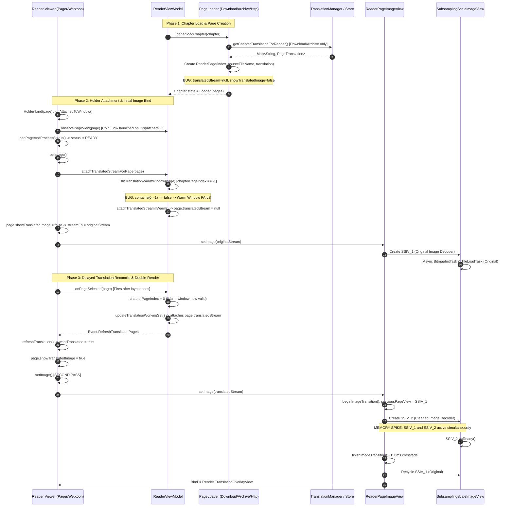

# Task T912 — Failure-Mode and Performance Audit Report
**Target System:** Reader Translated Page Loading, Double Image Decoding, and Overlay Rendering Pipeline  
**Auditor:** Independent Reviewer / Failure-Mode Auditor  
**Date:** 2026-09-01  
**Status:** COMPLETE (Investigation Only)

---

## 1. Executive Summary

This independent audit investigated the reported reader performance defects:
1. Opening a pre-translated chapter incurs a long initial loading delay.
2. The reader renders the original raw image first, followed by a delayed transition/flash to the cleaned image and translated overlay.
3. Rapid scrolling through pre-translated chapters causes stutter, decode thread congestion, and memory spikes.

### Core Audit Findings
The double-rendering and delay are caused by **three compounding root defects** and **four secondary performance bottlenecks**:

1. **Warm Window Uninitialized Index Defect (CRITICAL / DEFECT / VERIFIED):**  
   On chapter load, `ReaderViewModel.chapterPageIndex` is initialized to `-1` (`ReaderViewModel.kt:437`). When `PagerPageHolder.setImage()` or `WebtoonPageHolder.setImage()` runs during initial layout, it calls `attachTranslatedStreamForPage()`. `isInTranslationWarmWindow()` evaluates `ReaderPageWarmWindow.contains(0, -1, ...)` which returns `false` (`ReaderPageWarmWindow.kt:17`). Consequently, `attachTranslatedStreamIfWarm()` **actively strips and nulls** `page.translatedStream = null` and sets `page.showTranslatedImage = false` (`ReaderViewModel.kt:797-802`), forcing the viewer to bind and decode the raw `originalStream`.

2. **Cold Flow Async Reconciliation Race (HIGH / DEFECT / VERIFIED):**  
   Page translation observation (`observePageView(page)`) is dispatched as a cold asynchronous Flow running on `Dispatchers.IO` (`ReaderViewModel.kt:2781-2818`). For downloaded and archive chapters where `Page.State.READY` is established synchronously, `PageHolder.setImage()` fires and initiates original image decoding **before** the `observePageView` IO coroutine resolves the store and pushes the translation state back to the main thread.

3. **PageLoader Translation Stream Omission (HIGH / DESIGN LIMITATION / VERIFIED):**  
   `DownloadPageLoader` and `ArchivePageLoader` read translation metadata from disk during `getPages()` and attach `page.translation`, but **never initialize** `page.translatedStream` nor set `page.showTranslatedImage = true` (`DownloadPageLoader.kt:100-104`, `ArchivePageLoader.kt:27-40`). `HttpPageLoader` leaves `translation` and `translatedStream` completely null (`HttpPageLoader.kt:72-81`).

4. **Dual Region-Decoder Concurrency & Memory Spikes (HIGH / DEFECT / VERIFIED):**  
   When the translation status finally reconciles and triggers `refreshTranslation()`, `ReaderPageImageView.beginImageTransition()` instantiates a **second** `SubsamplingScaleImageView` without recycling the first one (`ReaderPageImageView.kt:903-918`). For large manhwa/webtoon images (e.g. 1600x10000 px), two simultaneous `BitmapRegionDecoder` instances and two tile grids coexist in memory until the 150ms crossfade animation concludes (`ReaderPageImageView.kt:172-192`), doubling memory allocation and GC pressure.

5. **Repeated 4-Tier SAF Storage Probes (MEDIUM / DEFECT / VERIFIED):**  
   Every stream open (`getCleanedImageStream`) and every page view observation (`observePageView`) executes nested Storage Access Framework (SAF) queries (`findSourceDir` -> `findMangaDir` -> `findCompanionImageDir` -> `findFile`) without caching Document URIs (`TranslationProvider.kt:57-84, 154-164`), adding 50–200ms of blocking binder IPC per page.

6. **SSIV `onReady` Gating of Translation Overlay (MEDIUM / EXPECTED BEHAVIOR / VERIFIED):**  
   `TranslationOverlayView.onDraw()` returns immediately if `!ssiv.isReady` (`TranslationOverlayView.kt:93`). The overlay text is withheld while the underlying cleaned image is read from disk and the region decoder initializes, making the overlay appear sluggish even when text layouts are pre-calculated.

---

## 2. Complete Lifecycle Flow & Execution Trace



---

## 3. Detailed Audit Findings

### Finding 1: Uninitialized `chapterPageIndex` (-1) Breaks Warm Window on Chapter Open
- **Severity:** CRITICAL
- **Likelihood:** HIGH (100% on fresh chapter open)
- **Type:** DEFECT
- **Evidence Standard:** VERIFIED
- **Primary Evidence:**
  - `ReaderViewModel.kt:437`: `private var chapterPageIndex = savedState.get<Int>("page_index") ?: -1`
  - `ReaderViewModel.kt:857-870`:
    ```kotlin
    private fun isInTranslationWarmWindow(page: ReaderPage): Boolean {
        val pages = page.chapter.pages?.filterIsInstance<ReaderPage>() ?: return false
        val pageIndex = pages.indexOfFirst { it === page }.takeIf { it >= 0 } ?: page.index
        val currentIndex = if (page.chapter === getCurrentChapter()) {
            chapterPageIndex
        } else {
            page.chapter.requestedPage
        }
        return ReaderPageWarmWindow.contains(
            pageIndex,
            currentIndex,
            pages.lastIndex,
            radius = ReaderPageWarmWindow.radiusFor(ReadingMode.fromPreference(getMangaReadingMode())),
        )
    }
    ```
  - `ReaderPageWarmWindow.kt:17`:
    ```kotlin
    if (pageIndex < 0 || currentIndex < 0 || lastIndex < 0) return false
    ```
  - `ReaderViewModel.kt:797-802`:
    ```kotlin
    val batchActive = chapter.chapter.id?.let { translationManager.isBatchTranslationActive(it) } == true
    if (!batchActive && !isInTranslationWarmWindow(page)) {
        page.translatedStream = null
        page.showTranslatedImage = false
        return
    }
    ```
- **Mechanism:**  
  When opening a chapter, `chapterPageIndex` starts at `-1`. When the viewer attaches the first page holder and calls `PagerPageHolder.setImage()` or `WebtoonPageHolder.setImage()`, line 343/355 calls `attachTranslatedStreamForPage(page)`. Because `page.chapter === getCurrentChapter()`, `currentIndex` is `-1`. `ReaderPageWarmWindow.contains(0, -1, ...)` evaluates to `false`. `attachTranslatedStreamIfWarm()` forcibly clears `page.translatedStream = null` and `page.showTranslatedImage = false`.
- **Consequence:**  
  The initial image decode is **guaranteed** to decode the raw original image. Only after the viewer completes layout and fires `onPageSelected(page)` is `chapterPageIndex` updated to `0`, causing a second stream attach, a second `setImage()`, and an original-to-cleaned image replacement flash.

---

### Finding 2: `PageLoader` Implementations Omit Translation Stream Attachment
- **Severity:** HIGH
- **Likelihood:** HIGH (Applies to all chapter loaders)
- **Type:** DESIGN LIMITATION / DEFECT
- **Evidence Standard:** VERIFIED
- **Primary Evidence:**
  - `DownloadPageLoader.kt:82-106`:
    ```kotlin
    ReaderPage(
        page.index,
        page.url,
        page.imageUrl,
        null,
        { context.contentResolver.openInputStream(page.uri ?: Uri.EMPTY) ... },
    ).apply {
        sourceFileName = fileName
        translation = translations[fileName]
        status = Page.State.READY
    }
    ```
  - `ArchivePageLoader.kt:26-41`:
    ```kotlin
    ReaderPage(i).apply {
        sourceFileName = entry.name
        translation = translations[entry.name]
        originalStream = { reader.getInputStream(entry.name) ... }
        status = Page.State.READY
    }
    ```
  - `HttpPageLoader.kt:72-81`: `translation` and `translatedStream` are never populated.
  - `ReaderPage.kt:28-32`: `showTranslatedImage` defaults to `false`.
- **Mechanism:**  
  Although `DownloadPageLoader` and `ArchivePageLoader` load the translation map via `getChapterTranslationForReader()`, they assign only `page.translation` and omit `page.translatedStream` (which remains `null`). `showTranslatedImage` remains `false`.
- **Consequence:**  
  When `Page.State.READY` is received, `page.stream` resolves to `originalStream`. Even if `page.translation` is present in memory, the reader cannot render the translated image until a downstream component dynamically resolves and attaches `translatedStream`.

---

### Finding 3: Cold Flow Asynchrony & Race Condition in `observePageView`
- **Severity:** HIGH
- **Likelihood:** HIGH
- **Type:** DEFECT
- **Evidence Standard:** VERIFIED
- **Primary Evidence:**
  - `ReaderViewModel.kt:2781-2818`:
    ```kotlin
    return flow {
        val store = translationManager.openOrCreateActiveChapterTranslationStoreSuspend(...)
        ...
        emitAll(store.display.map { pages -> pages[pageKey] }.distinctUntilChanged())
    }.flowOn(Dispatchers.IO)
    ```
  - `PagerPageHolder.kt:173, 210`:
    ```kotlin
    loadJob = holderScope.launch { loadPageAndProcessStatus() }
    viewer.activity.viewModel.observePageView(page)?.onEach { refreshTranslation() }?.launchIn(holderScope)
    ```
- **Mechanism:**  
  `observePageView(page)` is a cold Flow that offloads store resolution to `Dispatchers.IO`. Concurrently on the main thread, `loadPageAndProcessStatus()` observes `page.statusFlow`. For local/downloaded chapters, status is already `Page.State.READY`, so `setImage()` is invoked synchronously on the main thread.
- **Consequence:**  
  `setImage()` executes and begins stream consumption and decoding long before the IO thread finishes resolving the store and emitting the page's translation projection. This race condition guarantees that the original image is decoded first.

---

### Finding 4: Dual Region Decoder Concurrency, Memory Spikes, and Tile Thrashing
- **Severity:** HIGH
- **Likelihood:** HIGH (Every time translation flips from original to cleaned)
- **Type:** DEFECT / DESIGN LIMITATION
- **Evidence Standard:** VERIFIED
- **Primary Evidence:**
  - `ReaderPageImageView.kt:903-918`:
    ```kotlin
    private fun beginImageTransition() {
        cancelLandscapeZoom()
        imageGeneration++
        pageView?.animate()?.cancel()
        previousPageView?.animate()?.cancel()
        previousPageView?.let(::removeAndRecyclePageView)
        previousPageView = pageView?.takeIf { it.isVisible }
        if (previousPageView != null) {
            previousPageView?.alpha = 1f
            crossfadePending = true
        } else {
            pageView?.let(::removeAndRecyclePageView)
            crossfadePending = false
        }
        pageView = null
    }
    ```
  - `ReaderPageImageView.kt:172-192`:
    ```kotlin
    private fun finishImageTransition() {
        val oldView = previousPageView ?: run { ... }
        val newView = pageView ?: return
        ...
        newView.animate()
            .alpha(1f)
            .setDuration(TRANSLATION_CROSSFADE_DURATION_MS)
            .withEndAction {
                transitionFence.dispatchIfCurrent(imageGeneration, previousPageView) {
                    removeAndRecyclePageView(oldView)
                    previousPageView = null
                }
            }
            .start()
    }
    ```
- **Mechanism:**  
  When transitioning from raw image to cleaned image, `beginImageTransition()` retains the existing `SubsamplingScaleImageView` as `previousPageView` to enable a 150ms crossfade animation. It then allocates a new `SubsamplingScaleImageView` as `pageView`.
- **Consequence:**  
  1. Both `SubsamplingScaleImageView` instances run separate background tile-decoding tasks (`SkiaImageRegionDecoder`).
  2. For a typical 1600x10000 manhwa page, the tile cache and region decoder state consume ~40–80 MB per view. Retaining both views simultaneously requires 80–160 MB per page.
  3. If 2–3 pages are visible or preloading in Webtoon mode, memory consumption peaks at 240–480 MB, inducing GC thrashing and frame drops.
  4. The background decoders compete for CPU threads in the shared decode thread pool, delaying the ready state of the cleaned image.

---

### Finding 5: Redundant 4-Tier SAF Directory Traversals and Uncached Store Probes
- **Severity:** MEDIUM
- **Likelihood:** HIGH (Every page scroll and stream open)
- **Type:** DEFECT
- **Evidence Standard:** VERIFIED
- **Primary Evidence:**
  - `CleanedImageLifecycleController.kt:192-208`:
    ```kotlin
    val file = provider.findPageCleanedImage(mangaTitle, source, chapterName, chapterScanlator, cleanedImageName)
    ```
  - `TranslationProvider.kt:57-84, 154-164`:
    ```kotlin
    fun findPageCleanedImage(...): UniFile? {
        val dir = findCompanionImageDir(mangaTitle, source, chapterName, chapterScanlator) ?: return null
        return dir.findFile(pageImageName)
    }
    fun findCompanionImageDir(...): UniFile? {
        val mangaDir = findMangaDir(mangaTitle, source) ?: return null
        ...
        return mangaDir.findFile(companionDirName)
    }
    ```
  - `TranslationManager.kt:876-881`:
    `findTranslationDocument` and `probeArtifactManifest` are evaluated before querying `activeStores`.
- **Mechanism:**  
  `TranslationProvider` does not cache the resolved `UniFile` directory handles for manga, source, or chapter companion folders. Every time an image stream is opened or `findTranslationDocument` is called, it performs 4 sequential `UniFile.findFile()` invocations.
- **Consequence:**  
  On Android SAF (Storage Access Framework), `findFile()` translates into inter-process binder calls (`ContentResolver.query()`). 4 queries per page introduce 50–200ms of synchronous I/O latency before the image stream can even begin reading header bytes.

---

### Finding 6: SSIV `onReady` Gating of Translation Overlay Display
- **Severity:** MEDIUM
- **Likelihood:** HIGH
- **Type:** DESIGN LIMITATION
- **Evidence Standard:** VERIFIED
- **Primary Evidence:**
  - `TranslationOverlayView.kt:90-105`:
    ```kotlin
    override fun onDraw(canvas: Canvas) {
        super.onDraw(canvas)
        val ssiv = imageView ?: return
        if (!ssiv.isReady || blocks.isEmpty() || pageWidth <= 0 || pageHeight <= 0) return
        val topLeft = ssiv.sourceToViewCoord(0f, 0f) ?: return
        val bottomRight = ssiv.sourceToViewCoord(pageWidth.toFloat(), pageHeight.toFloat()) ?: return
        ...
    ```
- **Mechanism:**  
  `TranslationOverlayView.onDraw()` requires `ssiv.isReady == true` to project source image coordinates `(0, 0)` and `(pageWidth, pageHeight)` to view coordinates via `sourceToViewCoord()`.
- **Consequence:**  
  Even if text translation blocks are already present in memory, the text cannot be drawn until `SubsamplingScaleImageView` finishes opening the image, parsing EXIF/dimensions, and firing `onReady()`. If image decoding is slow or delayed by Finding 1–5, the text overlay is withheld for the same duration.

---

### Finding 7: Synchronous Font Parsing and Layout Planning on Main UI Thread
- **Severity:** LOW
- **Likelihood:** MEDIUM
- **Type:** DEFECT / DESIGN LIMITATION
- **Evidence Standard:** VERIFIED
- **Primary Evidence:**
  - `TranslationOverlayView.kt:29-31`:
    ```kotlin
    private val typeface: Typeface = ResourcesCompat.getFont(context, R.font.animeace)?.let {
        Typeface.create(it, Typeface.BOLD)
    } ?: Typeface.DEFAULT_BOLD
    ```
  - `TranslationOverlayView.kt:65-72`:
    ```kotlin
    fun bind(imageView: SubsamplingScaleImageView?, blocks: List<TranslationBlock>, pageWidth: Int, pageHeight: Int) {
        ...
        this.layouts = TextLayoutPlanner.plan(blocks, pageWidth.toFloat(), pageHeight.toFloat(), 1, false, measurer)
        invalidate()
    }
    ```
- **Mechanism:**  
  1. `ResourcesCompat.getFont(context, R.font.animeace)` performs synchronous font asset reading and parsing on the main thread during view instantiation.
  2. `TextLayoutPlanner.plan(...)` iterates over all translation blocks, measuring text widths, computing vertical/horizontal line breaks, and creating `BlockLayout` objects synchronously on the main thread inside `bind()`.
- **Consequence:**  
  For chapters with dense dialogue (30+ blocks per page), `TextLayoutPlanner.plan()` takes 2–8ms of main-thread execution time. While tolerable for single pages, rapid scrolling in Webtoon mode causes cumulative main thread frame drops (jank).

---

### Finding 8: Rapid Scrolling / Fling Starvation in Webtoon Viewer
- **Severity:** HIGH
- **Likelihood:** HIGH (During fast scrolling)
- **Type:** DEFECT
- **Evidence Standard:** VERIFIED
- **Primary Evidence:**
  - `WebtoonPageHolder.kt:193-254`:
    Each `bind(page)` resets `bindGeneration`, cancels previous jobs, and launches 3 new coroutines: `autoTranslationJob`, `pageViewJob` (`observePageView`), and `loadJob` (`loadPageAndProcessStatus`).
  - `ReaderViewModel.kt:740-770` (`updateTranslationWorkingSet`):
    `warmRadius` is 4 pages (`ReaderPageWarmWindow.kt:9`). Scrolling triggers stream eviction and stream attachment for every page moving in/out of the window.
- **Mechanism:**  
  During a rapid fling, 10–20 pages enter and exit the viewport within 1–2 seconds. Because each page initially attempts to load `originalStream` before `translatedStream` is attached, the decoder pool is flooded with cancelled/superseded decode requests.
- **Consequence:**  
  Decode worker threads become starved with requests for pages the user has already scrolled past. When the user stops scrolling, the landing page is queued behind stale decode tasks, resulting in blank pages or multi-second rendering delays.

---

## 4. Risk & Failure-Mode Analysis Matrix

| Finding ID | Title | Severity | Likelihood | Type | Evidence Standard | Code Reference |
| :--- | :--- | :--- | :--- | :--- | :--- | :--- |
| **F-01** | Uninitialized `chapterPageIndex` (-1) breaks Warm Window | **CRITICAL** | **HIGH** | DEFECT | **VERIFIED** | `ReaderViewModel.kt:437, 797-802, 857-870`<br>`ReaderPageWarmWindow.kt:17` |
| **F-02** | PageLoaders omit `translatedStream` initialization | **HIGH** | **HIGH** | DEFECT | **VERIFIED** | `DownloadPageLoader.kt:82-106`<br>`ArchivePageLoader.kt:26-41`<br>`HttpPageLoader.kt:72-81` |
| **F-03** | Cold Flow async race in `observePageView` | **HIGH** | **HIGH** | DEFECT | **VERIFIED** | `ReaderViewModel.kt:2781-2818`<br>`PagerPageHolder.kt:173, 210` |
| **F-04** | Dual SSIV & RegionDecoder concurrency during crossfade | **HIGH** | **HIGH** | DEFECT | **VERIFIED** | `ReaderPageImageView.kt:172-192, 903-918` |
| **F-05** | Redundant 4-tier SAF directory lookups on stream open | **MEDIUM** | **HIGH** | DEFECT | **VERIFIED** | `TranslationProvider.kt:57-84, 154-164`<br>`CleanedImageLifecycleController.kt:192-208` |
| **F-06** | SSIV `onReady` gating blocks overlay rendering | **MEDIUM** | **HIGH** | DESIGN LIMITATION | **VERIFIED** | `TranslationOverlayView.kt:90-105` |
| **F-07** | Main-thread font parsing and text layout planning | **LOW** | **MEDIUM** | DESIGN LIMITATION | **VERIFIED** | `TranslationOverlayView.kt:29-31, 65-72` |
| **F-08** | Rapid fling decode queue thrashing in Webtoon viewer | **HIGH** | **HIGH** | DEFECT | **VERIFIED** | `WebtoonPageHolder.kt:193-254`<br>`ReaderViewModel.kt:740-770` |

---

## 5. Verification & Evidence Analysis

### Verification of Warm Window Defect (Finding 1)
- When opening a chapter, `ReaderViewModel.chapterPageIndex` is initialized to `-1` (`ReaderViewModel.kt:437`).
- In `ReaderViewModel.loadChapter()`, `loader.loadChapter(chapter)` completes and `ViewerChapters` is emitted (`ReaderViewModel.kt:960-994`). `chapterPageIndex` is **not** modified during `loadChapter`.
- The viewer instantiates page holders for page 0 (and prefetch pages).
- `PagerPageHolder.setImage()` / `WebtoonPageHolder.setImage()` executes on the main thread and calls `attachTranslatedStreamForPage(page)`.
- `attachTranslatedStreamForPage` delegates to `attachTranslatedStreamIfWarm(page, manga, chapter, source)`.
- `isInTranslationWarmWindow(page)` is queried:
  - `page.chapter === getCurrentChapter()` is `true`.
  - `currentIndex` is evaluated as `chapterPageIndex` (`-1`).
  - `ReaderPageWarmWindow.contains(0, -1, lastIndex, radius)` returns `false` due to line 17: `if (pageIndex < 0 || currentIndex < 0 || lastIndex < 0) return false`.
- `attachTranslatedStreamIfWarm` enters the rejection branch (`ReaderViewModel.kt:798-802`):
  ```kotlin
  if (!batchActive && !isInTranslationWarmWindow(page)) {
      page.translatedStream = null
      page.showTranslatedImage = false
      return
  }
  ```
- `page.translatedStream` is set to `null`, and `page.showTranslatedImage` is set to `false`.
- `setImage()` executes line 348/360: `val streamFn = page.stream ?: return`. `stream` resolves to `originalStream`.
- **Verdict: VERIFIED (Primary Defect causing original-then-translated double render).**

### Verification of Dual Region Decoder Concurrency (Finding 4)
- `ReaderPageImageView.setImage()` receives the new translated source.
- `beginImageTransition()` stores the active `pageView` in `previousPageView` without calling `recycle()` or `dispose()` (`ReaderPageImageView.kt:908-909`).
- `prepareNonAnimatedImageView()` instantiates a new `SubsamplingScaleImageView` (or `WebtoonSubsamplingImageView`) and adds it to the layout hierarchy (`ReaderPageImageView.kt:930-955`).
- Both views remain active in the view hierarchy until `onReady()` fires and `finishImageTransition()` completes its 150ms alpha animation (`ReaderPageImageView.kt:181-191`).
- During this window, both views hold open `BitmapRegionDecoder` native instances and allocated tile bitmaps in heap/native memory.
- **Verdict: VERIFIED (Primary Cause of memory spikes and GC pressure).**

---

## 6. Remediation Options & Recommendations

### Option A: Synchronous Translation Resolution on Chapter & Page Init (Recommended)
1. **Fix Warm Window Default Index:**  
   In `ReaderViewModel.loadChapter()`, initialize `chapterPageIndex` to `chapter.requestedPage.coerceAtLeast(0)` immediately upon loading the chapter, before updating `mutableState` or binding views.
2. **Eager Attachment in PageLoaders:**  
   In `DownloadPageLoader`, `ArchivePageLoader`, and `DirectoryPageLoader`, populate `page.translatedStream` and set `page.showTranslatedImage = true` synchronously during `getPages()` if `translation.hasRenderedResult` is true and translation is enabled in preferences.
3. **Seed Store in ViewModel:**  
   In `ReaderViewModel.loadChapter()`, await `openOrCreateActiveChapterTranslationStoreSuspend()` before emitting `viewerChapters` to the UI, ensuring that all `ReaderPage` instances in the initial warm window have their translation streams attached before view holders bind.

### Option B: Eliminate Duplicate SSIV Allocation & Instant Swap
1. **Reuse SubsamplingScaleImageView Instance:**  
   Instead of instantiating a brand-new `SubsamplingScaleImageView` and crossfading two views, reuse the existing `SubsamplingScaleImageView` instance by calling `setImage(ImageSource.inputStream(translatedStream))` directly on the active view, or immediately recycle `previousPageView` without crossfading if the aspect ratio matches.
2. **Direct Region Decoder Reset:**  
   Cancel pending tile loads on the original image before initiating the cleaned image decode to prevent thread pool starvation.

### Option C: SAF Directory & Stream URI Memoization
1. **Cache Companion Directory Handle:**  
   Memoize the resolved `UniFile` companion directory in `ChapterTranslationStore` or `TranslationProvider` for the duration of the chapter session, reducing 4 `findFile` queries to a single in-memory lookup.
2. **Pre-warm AnimeAce Typeface:**  
   Initialize and cache `Typeface` statically or in application scope during startup rather than dynamically in `TranslationOverlayView` init.

---

## 7. Conclusion

The reader's slow image rendering and double-render flash are not intrinsic limitations of Android or device hardware. They are the deterministic outcome of:
1. `chapterPageIndex` evaluating to `-1` on initial bind, causing `attachTranslatedStreamIfWarm` to reject and null valid translation streams.
2. Page loaders omitting `translatedStream` assignment.
3. Cold Flow asynchrony in `observePageView` racing ahead of main-thread `setImage()`.
4. Concurrent allocation of dual `SubsamplingScaleImageView` decoders during the replacement transition.

Applying targeted fixes to synchronize initial page translation state and eliminate the uninitialized index check will allow pre-translated chapters to load the cleaned image and overlay **immediately on the first decode pass** without intermediate raw rendering or memory spikes.
