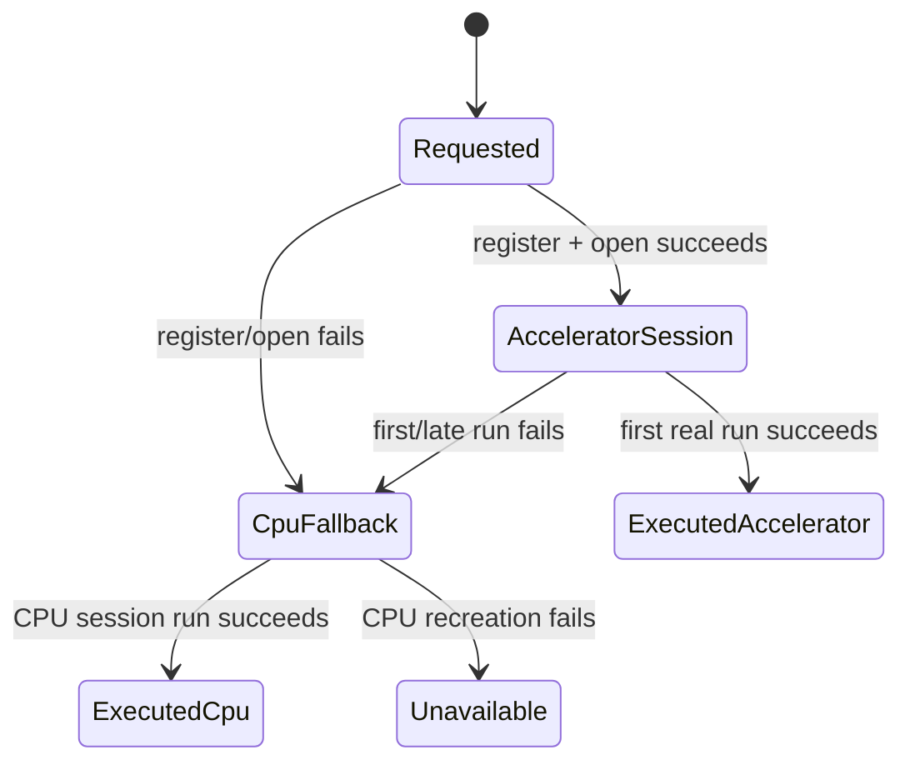

# PaddleOCR provider selector — architecture options

## Recommendation

Implement **Option B: a PaddleOCR-specific preference plus an explicit provider/session factory**. Keep CPU as the default; expose CPU, QNN GPU, and QNN HTP as temporary choices; pass one immutable selection to both the Paddle v6 recognizer and Paddle line-splitting detector; keep all other inference on its current global route; and report requested/registered/executed/fallback states independently.

This is the smallest design that can answer the experiment honestly without changing normal manga routing. It also isolates the known `createSessionWithFallback` stale-route defect instead of making that generic path carry a second, partially overlapping policy.

## Options considered

| Option | Shape | Benefits | Risks / reason not selected |
|---|---|---|---|
| A. Reuse/extend global hardware preference | Add GPU or reinterpret `translation_hardware_accelerator` | Small UI/persistence diff | Global setting affects page detector, segmenter, inpainting, and every OCR engine; cannot guarantee Paddle detector/recognizer pairing; `AUTO` and circuit-breaker semantics remain implicit. **Reject.** |
| B. Dedicated Paddle preference + explicit factory | New CPU/GPU/HTP enum and explicit `OnnxRuntimeProvider`/factory entry point | Narrow scope, deterministic backend, easy provenance, no automatic-route gate, CPU-safe default, paired sessions. **Recommend.** | Requires a small preference/UI/API/rebuild seam and tests. |
| C. Add a provider override to generic `createSessionWithFallback` | Pass a nullable route/provider and branch inside current method | Reuses fallback code | Easy to accidentally combine explicit choice with `activeRoute`, model status, global breaker, or a second `resolveRoute()`; semantics of automatic and explicit calls become difficult to audit. Viable only if the explicit branch is fully separate internally. |
| D. Select provider separately per engine/session | Independent recognizer and detector controls | Maximum experimentation | Mixed routes make OCR failures/latency impossible to attribute and violate the intended paired test. **Reject.** |

## Recommended boundaries

```mermaid
flowchart LR
    P[translation_paddle_ocr_provider<br/>CPU | QNN_GPU | QNN_HTP] --> L[EngineLane rebuild key]
    L --> R[RoiPageRecognitionEngine]
    R --> S[one immutable Paddle selection]
    S --> REC[PaddleOcrV6SmallEngine]
    S --> DET[PaddleOcrV6DetEngine]
    REC --> F[Paddle explicit session factory]
    DET --> F
    F --> CPU[CPU session]
    F --> GPU[QNN GPU, strict]
    F --> HTP[QNN HTP, strict]
    PAGE[General detectors/segmenters/inpainting] --> AUTO[Existing automatic global route]
```

The explicit factory may live in `OnnxRuntimeProvider` as a named method or in a small `PaddleOcrSessionFactory`; the important boundary is that it accepts a typed requested provider rather than `useAccelerator: Boolean`. It must not call the automatic route gate as a side effect.

## Proposed contract

Use a domain/runtime-neutral preference value with three choices:

```text
PaddleOcrExecutionProvider.CPU
PaddleOcrExecutionProvider.QNN_GPU
PaddleOcrExecutionProvider.QNN_HTP
```

Persist it separately from `translation_hardware_accelerator`, for example under `translation_paddle_ocr_provider`, with **CPU as the default**. Keep the existing global preference and its `AUTO`/`QUALCOMM_NPU`/`CPU_XNNPACK` behavior unchanged.

The session factory should return a session plus explicit state, conceptually:

```text
requestedProvider: PaddleOcrExecutionProvider
registeredProvider: RegisteredExecutionProvider
executedProvider: RegisteredExecutionProvider? // null until first successful run
fallbackReason: String?
availability: AVAILABLE | CPU_FALLBACK | UNAVAILABLE_OR_UNTESTED
```

The existing `executionProviderLabel` can remain as a compatibility display field, but it must not be used as execution proof. Mark execution only after the first real `OrtSession.run` succeeds. If a later run fails, update the state through the guarded recreation path.

## Exact backend behavior

### CPU

Use the current CPU/XNNPACK registration path with `registeredProvider=CPU` and `executedProvider=CPU`. This is the default and is the only behavior required to work on every supported device.

### QNN GPU

Register QNN with:

```text
backend_type = gpu
session.disable_cpu_ep_fallback = 1
```

The strict setting prevents an apparently successful session from silently executing unsupported partitions on CPU. If registration or session creation fails, close the attempt and create CPU, recording the requested QNN GPU and the failure reason.

### QNN HTP/NPU

Register QNN with:

```text
backend_type = htp
session.disable_cpu_ep_fallback = 1
```

Use the existing generic-first HTP option policy; optionally supply known device values (`soc_model=57`, `htp_arch=75` for the source SM8650 mapping) when the factory has a verified device capability. Do not enable context caching for the temporary selector unless cache file ownership and invalidation are specified.

The current Paddle assets appear float32 and ORT documents HTP as requiring quantized models. Therefore HTP must be exposed as an experiment but initially reported as unavailable/CPU-fallback until strict creation and real inference pass on the target. GPU is more plausible for float32, but it also requires device verification.

## Fallback and automatic routing rules

The explicit factory must not:

- read `HardwareDiscoveryEngine.activeRoute` as its decision;
- call `HardwareDiscoveryEngine.resolveRoute()` to replace the user choice;
- call `ModelRoutingEngine.isAcceleratorAttemptAllowed()` to suppress the explicit experiment;
- trip the global hardware circuit breaker on a Paddle experiment failure;
- mark a QNN model supported merely because `OrtSession` was constructed.

It may use the existing low-level option builders and typed registration labels. The automatic path's known bug should be fixed independently by resolving one route snapshot and passing it through gate/options/failure accounting, but that repair is not a substitute for the explicit path.

Recommended state transition:



The user-visible diagnostic should distinguish “requested QNN HTP, fell back to CPU because unsupported graph” from “QNN HTP executed.” A session-open label alone is insufficient.

## Detector/recognizer pairing

At `RoiPageRecognitionEngine` initialization:

1. Snapshot the preference once.
2. Pass that same value to `PaddleOcrV6SmallEngine.initialize` and `PaddleOcrV6DetEngine.initialize`.
3. Keep general page detection, panel detection, bubble segmentation, and other ONNX engines on their current automatic route.
4. When non-Paddle OCR loads `paddleDet` only for an inpainting mask, keep that mask-only session on its existing route. The temporary selector must not alter MLKit/MangaOCR behavior.

This makes an OCR run internally consistent and avoids a normal-reader regression caused by a temporary performance control.

## Preference/UI/lifecycle integration

- Add the new preference in `TranslationPreferences` with CPU default and stable serialization.
- Add a clearly labelled temporary PaddleOCR v6 row in translation settings. A debug-only row is safest while hardware coverage is being measured; if the product requires release visibility, retain the explicit “temporary / may fall back to CPU” wording.
- Include the provider in `EngineLane.ensureEnginesBuiltFor`'s rebuild identity, or close engines synchronously when the preference changes. The preferred route is to add it to the rebuild key so a new session pair is built exactly when needed.
- Keep session replacement under `RoiPageRecognitionEngine.nativeGuard`; never mutate a session while `analyze`/recognition is running.
- Persisting a new choice must not retroactively change an already-built session. The next engine build is the point at which the choice is snapshotted.

## Test and rollout gates

### Unit/pure tests

- preference default and enum serialization;
- provider-to-QNN option mapping, including strict CPU fallback;
- explicit factory does not consult automatic route/gate/circuit-breaker state;
- CPU fallback provenance on registration, open, first-run, and later-run failure;
- recognizer/detector receive the same snapshot;
- provider change causes engine recreation, unchanged provider does not;
- non-Paddle inpainting mask remains on its old route.

### Device gates

On the target arm64 Snapdragon/SM8650 device, collect separate results for:

1. CPU baseline;
2. QNN GPU session creation and real OCR inference;
3. QNN HTP strict session creation and real OCR inference;
4. repeated inference and any SSR/recreation behavior;
5. recognizer and detector provenance independently.

Until these runs exist, label QNN choices **UNTESTED** (and HTP likely **UNAVAILABLE** for the current float32 model), not “accelerated.” Native library packaging, route discovery, and session construction alone do not satisfy the execution gate.

## Design gate conclusion

Approve Option B. It is a contained temporary experiment with a CPU escape hatch, preserves the global routing contract for normal OCR, and makes the two facts implementation currently conflates—requested provider and actually executed provider—observable. Fix the generic `activeRoute`/`resolveRoute()` inconsistency separately, but do not build the selector by extending that implicit automatic path.
