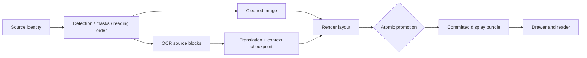

# Batch Translation Reliability and Context Quality — Final Plan

**Status:** Ready for implementation breakdown after review  
**Target branch:** `feat/npu-acceleration-and-hardware-discovery` (the `npu` branch)  
**Source of the current refactor:** `refactor_batch_translation_ux`  
**Scope:** Chapter batch translation only, except for shared reader/store contracts required to display committed results correctly  
**Investigation:** [2026-08-19-batch-translation-plan-implementation-investigation.md](./2026-08-19-batch-translation-plan-implementation-investigation.md)

## 1. Outcome

Batch translation must behave like a resumable, sequential compiler rather than a disposable background job:

1. Every batch scans the chapter in natural page order, page 1 through page N.
2. It reuses every valid artifact and resumes at the first incomplete or invalid stage.
3. A new attempt never removes the last displayable translated page.
4. The drawer and reader use one definition of “ready.”
5. Translation context advances only in natural page order and cannot treat an earlier model guess as source truth.
6. Anonymous speakers can be linked to named characters over a bounded page/turn evidence window.
7. Mature scenes preserve source meaning, viewpoint, agent, action, and recipient without censorship or invented relationships.
8. The solution remains bounded for devices with 6 GB RAM and does not duplicate native inference.

## 2. Settled Product Rules

These are requirements, not implementation suggestions.

- Batch order is always page 1 to page N. `lastPageRead`, current reader page, and viewport visibility never rotate or reprioritize a batch.
- Resume means scan from page 1, reuse valid work, and begin new work at the first incomplete stage. It does not mean start at the page the user last read.
- Native work may prefetch a small bounded window, but translation and context commits remain strictly ordered.
- A page is counted as ready only when the exact committed bundle the reader can display is ready.
- OCR plus translated strings is not display readiness when cleaning or layout is missing.
- Partial translation is not counted as ready. The last committed complete bundle may remain visible while a replacement is incomplete.
- A textless page is terminally complete without translation. It displays the original image unless a separately requested cleaning policy says otherwise.
- Pause preserves resumable candidate work. Cancel discards only uncommitted candidate work. Neither operation deletes the last committed bundle.
- A retry writes a candidate generation. It never edits the visible committed generation in place.
- Batch translation adds `batchRelationshipAmbiguityPrior` with `NEUTRAL` and `MALE_FEMALE` values. For this product decision its default is `MALE_FEMALE`; it is exposed in batch-translation settings, applies only to batch AI translation, and explicit source evidence always wins.
- Sexual or mature content is translated faithfully. The pipeline must neither censor it nor increase its explicitness.
- These context-quality changes do not alter manual or automatic single-page reader translation.

## 2.1 Execution Terms

- **Page commit unit:** one natural chapter page. Translation/context may commit only for the longest validated, gap-free page prefix.
- **AI request envelope:** 1–4 consecutive pages, at most 24 accepted OCR blocks, additionally capped by the provider token budget. It reduces calls but is not a transaction boundary.
- **Native lookahead:** at most three pages beyond the current page, bounded by decoded-frame and native-buffer limits.
- **Identity evidence window:** current page plus at most three preceding and three lookahead pages, never more than 36 source turns.
- **Context checkpoint:** trusted state after one committed page. There is no checkpoint that skips a failed page.

## 3. Required Architecture

Each page has two logical generations:

- **Committed:** immutable, complete, reader-visible, and safe to reuse.
- **Candidate:** work in progress for a new run. It may be paused, retried, invalidated, or discarded without changing the committed bundle.

Large images remain versioned files. The store holds their identities, fingerprints, provenance, stage status, and committed/candidate pointers; it does not duplicate image bytes in JSON.

Promotion is atomic at the metadata level and happens only after all referenced files exist, are non-empty, and match the candidate fingerprints. Old files are garbage-collected only after promotion and after active reader streams no longer depend on them.

The exact stage contract is defined in [2026-08-19-batch-artifact-lifecycle-contract.md](./2026-08-19-batch-artifact-lifecycle-contract.md).

## 4. One Batch Execution Path

The current competing coordinator paths must be consolidated into one production path.

1. Load chapter records and source identities.
2. Iterate canonical page keys in natural order.
3. For each stage, produce a deterministic decision: `REUSE`, `RUN`, `WAIT_FOR_DEPENDENCY`, `TERMINAL_COMPLETE`, or `FAILED`, including a reason code.
4. Begin work at the earliest page/stage marked `RUN`.
5. Decode each source page at most once per native pass. Detection, OCR, mask generation, and inpainting consume that decoded frame before it is released.
6. Keep only the bounded native lookahead defined above. Local native inference remains serialized.
7. Form translation chunks after OCR supplies real block counts; do not use placeholder density.
8. Send AI request envelopes in page/panel/bubble order. The response contains page-scoped translations and context deltas. Commit only the longest valid page prefix; stop at the first invalid page and retry the suffix from the preceding trusted checkpoint.
9. Render candidates after cleaned-image and translation dependencies are ready.
10. Promote each complete page bundle independently within that validated prefix, in natural order. Never advance context or promote a later page across a failed page.

The reader’s single-page urgency flow remains separate and uses `READER_ADHOC` provenance. Its output may be committed and displayed, but it is never authoritative rolling context. When a batch later reaches it, valid native artifacts are reused and translation is refreshed under the batch protocol while the ad-hoc committed result stays visible. Both paths use the same page/stage lease and candidate-generation write discipline; a reader request attaches to or waits for an active batch owner instead of overwriting it.

## 5. Translation Correctness and Context

The first correctness fix is globally unique block IDs across a multi-page request. IDs encode stable page and block identity, for example `p0007_b0003`; reading order is separate metadata and never part of the ID. Duplicate, missing, or unknown IDs make a response invalid.

The batch AI request uses a compact, versioned scene card instead of an ever-growing prose summary:

- 4–6 active character profiles at most;
- temporary speakers such as `Speaker A`, `Speaker B`, narrator, and unknown third party;
- named profiles with aliases and evidence-backed identity links;
- last 6–12 source turns, not translated turns as factual evidence;
- a 50–80 word narrative summary;
- unresolved references and current point of view;
- page, panel, bubble, and reading order;
- a total context target of roughly 300–600 tokens, excluding the current source chunk.

The model returns translations and a proposed context delta in one response. Deterministic validation accepts or rejects that delta. Model confidence alone never confirms a fact.

Identity evidence is ranked:

1. explicit source pronoun, title, relationship, or self-identification;
2. source-language gendered address or first-person form, weighted by OCR confidence;
3. a name, speech style, or the batch relationship setting only as weak evidence;
4. a previous translated pronoun is not evidence.

Names mentioned in dialogue are not automatically assigned to the current speaker. Linking a named character to a temporary speaker uses the deterministic identity evidence window defined above.

Tentative facts remain local hints. If corrected inside the window, only affected translation and render stages are redone, and exact-match manual edits are reapplied. If an explicit later contradiction changes a fact that entered a durable checkpoint, every downstream translation whose provenance depends on that checkpoint is invalidated; OCR and inpainting remain reusable, and manual edits remain authoritative for exact source-block matches. The previous committed pages stay visible during refresh.

The full contract is defined in [2026-08-19-batch-ai-context-quality-contract.md](./2026-08-19-batch-ai-context-quality-contract.md).

## 6. Drawer and Reader Contract

The store exposes one canonical `PageDisplayState` derived from the committed bundle plus candidate/failure metadata:

- `ORIGINAL_ONLY`
- `CANDIDATE_RUNNING`
- `DISPLAY_READY`
- `REFRESHING_WITH_COMMITTED_RESULT`
- `FAILED_WITH_COMMITTED_RESULT`
- `FAILED_NO_RESULT`
- `TEXTLESS_COMPLETE`

The drawer, chapter-list badge, progress tracker, and reader all consume this state. They do not independently infer readiness from OCR or translation flags.

- “Ready (N)” counts committed translated bundles, including `READER_ADHOC` bundles and pages retaining a bundle during refresh/failure. A separate processed count includes textless pages. Batch-protocol completeness remains separate, so an ad-hoc page can be readable while still queued for ordered batch refresh.
- “Read translated pages” is enabled only when at least one committed translated bundle exists. A separate “Open chapter” action may always open originals.
- Progress uses real chapter page numbers, not positions in a rotated queue.
- Entering the reader resolves the committed image and layout identities atomically. A candidate emission cannot null the committed stream.
- A fresh page with no committed bundle displays the original while progress continues.

## 7. Implementation Sequence

### Phase 0 — Baseline and Characterization

- Confirm the exact `npu` target head and preserve its NPU/hardware changes.
- Create the implementation branch from the latest `feat/npu-acceleration-and-hardware-discovery` head. All later phases land there incrementally.
- Record the refactor commits to port; do not blindly merge the whole worktree.
- Mark the current rotated scheduler, competing coordinator, inert viewport priority, and in-memory rolling-summary path as explicitly superseded so new schema/pipeline work is not built around them.
- Add characterization tests for current ordering, readiness, store emission, cancellation, and reader fallback before changing behavior.
- Add counters around decode, detector, OCR, inpaint, translator, and render invocation to verify reuse.

### Phase 1 — Protocol Correctness

- Make multi-page translation IDs globally unique and validate response cardinality.
- Add protocol versioning and strict parsing for translation plus context delta.
- Keep this behind the batch AI path only.

### Phase 2 — Artifact Schema and Migration

- Introduce explicit per-stage status, provenance, fingerprints, and committed/candidate generations.
- Migrate legacy page records conservatively. Treat missing provenance as unknown, not automatically invalid or valid.
- Recover reusable OCR/inpaint/translation only when its dependencies can be proven; otherwise rerun the earliest uncertain stage while preserving the old display bundle.
- Define the concrete chapter manifest, immutable stage sidecars, checkpoint sidecars, generation directories, retention budget, and atomic pointer format before pipeline changes.

### Phase 3 — Store Transactions and Reader Safety

- Extend the existing `patchPage`, `patchBlock`, and stage-merge generation/page-version/fingerprint preconditions to detection/OCR writes and display promotion; do not rebuild the existing concurrency foundation.
- Implement atomic promotion and rollback/discard semantics.
- Make reader-visible flows observe committed pointers only.
- Give reader-originated writes `READER_ADHOC` provenance and the same lease/candidate discipline as batch writes.
- Add safe file-retention and garbage-collection rules.

### Phase 4 — Lifecycle Planner and Natural Ordering

- Replace `lastPageRead` rotation with canonical page order.
- Implement the deterministic stage planner and first-incomplete resume scan.
- Separate display completeness from context-checkpoint completeness.
- Remove viewport priority from chapter batch scheduling.

### Phase 5 — Coordinator Consolidation and Memory Bounds

- Select one coordinator and remove/bypass the competing production path.
- Use at most one full-resolution inpaint decode and one bounded OCR decode per page; permit a measured adaptive OCR re-decode when sampling/OOM recovery requires it.
- Use actual OCR block counts for dynamic chunk formation.
- Enforce one native worker, one ordered translation lane, bounded channels, and cancellation checks between stages.

### Phase 6 — Batch Context Quality

- Add scene cards, source-evidence ledger, temporary speakers, named-profile linking, and trusted context checkpoints.
- Add the batch-only relationship-prior preference end to end: domain key, `NEUTRAL`/`MALE_FEMALE` enum, default, batch settings UI, prompt input, and fingerprint version. Apply it only at final tie-breaking.
- Add bounded correction and downstream dependency invalidation.
- Reset legacy/poisoned context from page 1 while reusing native artifacts.

### Phase 7 — Unified UI Readiness

- Move drawer, chapter-list, and reader logic to `PageDisplayState`.
- Correct ready counts, actions, page numbering, pause/cancel states, and refresh presentation.
- Ensure a candidate never hides a committed result.

### Phase 8 — Cleanup, Privacy, and Observability

- Remove inactive scheduler/context abstractions after their replacement is covered.
- Log stage decisions, fingerprints, timings, and confidence transitions without logging source dialogue, translated mature text, prompts, or scene-card contents.
- Store compact context data in app-private chapter storage and delete it with chapter translation data.

### Phase 9 — NPU Integration and Gates

- Confirm every phase is already landed on the NPU-based implementation branch. Treat this refactor worktree as audited source material rather than the implementation base.
- Resolve behavior intentionally instead of preferring either side wholesale.
- Run focused tests per touched package, then the repository finish gate from `AGENTS.md`.
- Perform the manual/failure matrix in [2026-08-19-batch-translation-validation-matrix.md](./2026-08-19-batch-translation-validation-matrix.md).

## 8. Risks and Explicit Mitigations

| Risk | Required mitigation |
|---|---|
| Schema migration destroys old translations | Preserve legacy display data as the initial committed generation; rebuild candidates separately. |
| Tentative identity correction poisons later chunks | Do not promote tentative facts early; track checkpoint dependencies and cascade invalidation when necessary. |
| The romance prior mistranslates explicit LGBT or non-romance content | Source evidence always overrides; activate the prior only for unresolved relationship ambiguity. |
| OCR errors become “source facts” | Weight evidence by OCR confidence and repetition; quarantine contradictions. |
| Mature-content provider returns a structural refusal | Treat it as failure, do bounded retries, retain old result, and never promote refusal prose. |
| A structurally valid translation is semantically sanitized | Prompt and best-effort coverage/refusal heuristics reduce risk, but cannot prove faithfulness deterministically; evaluate with curated/manual quality fixtures and do not make perfect detection a release blocker. |
| Context sidecars expose sensitive dialogue | Persist compact facts, not long raw dialogue; app-private storage; redact logs. |
| Candidate files leak storage | Generation-scoped garbage collection after cancellation, promotion, and reader-stream release. |
| Strict ordering reduces throughput | Bounded native lookahead overlaps safe stages, while context-sensitive commits remain ordered. |
| Reader and batch duplicate work | Per-page/stage ownership lease with generation and page-version preconditions. |
| Prompt injection inside OCR text | Delimit source as data, instruct the model not to execute it, and reject protocol-breaking output. |

## 9. Definition of Done

The work is complete only when all of the following hold:

- Re-pressing batch translation never removes a committed translated page.
- A chapter always processes in natural order and resumes from the first invalid stage.
- Unchanged completed chapters cause zero detector, OCR, inpaint, translation, and render invocations.
- Changing only target language reruns translation and render, not native stages.
- Changing only inpaint configuration reruns inpaint and render, not OCR or translation.
- Killing the app at every stage boundary preserves the committed bundle and resumes valid candidate work.
- Drawer ready counts exactly match translated pages visible in the reader.
- Multi-page translation responses cannot collide block IDs.
- Anonymous-to-named speaker linkage and tentative-gender correction pass bounded-context tests.
- The batch relationship preference exists end to end, affects provenance, and explicit source evidence overrides it.
- Mature-scene tests preserve viewpoint and semantic roles without censorship or invention.
- Memory and decode counts remain within the agreed device budget.
- The reviewed changes are integrated onto the latest `npu` branch with focused and finish-gate validation passing.

## 10. Deliberately Deferred

- Cross-chapter or manga-wide character memory. Version 1 is chapter-scoped.
- Visual gender classification from character images.
- Automatic provider switching after a content refusal.
- Applying the scene-card protocol to non-batch reader translation.
- A new translation editor UI beyond preserving and reapplying existing manual edits.

## 11. Adversarial Review Disposition

The independent critique at `artifacts/2026-08-19-batch-translation-plans-critique/index.md` initially found the plan unready. The revision addresses every implementation blocker:

- Multi-page requests are transport envelopes; page-prefix commits prevent context gaps.
- Reader single-page writes now have explicit `READER_ADHOC` provenance and shared lease/write discipline.
- The relationship prior is specified as a real batch-only preference with default, UI surface, enum, scope, and fingerprint behavior.
- Chunk-sized windows were replaced with deterministic page/block/turn bounds.
- Context corruption explicitly triggers translation-only suffix recovery.
- Manual edits survive context-driven retranslation.
- Sanitization detection is described honestly as best effort rather than a deterministic promise.
- Decode limits preserve adaptive OCR sampling and full-resolution inpaint quality.
- IDs no longer depend on reading order.
- Evidence promotion requires independent non-model signals.
- Textless pages with detector-only erase masks may use a cleaned display base.
- Migration now defines crash-safe writes, legacy-state mappings, durable failures, glossary handling, and storage layout.
- Implementation begins from the NPU branch rather than building a large series on superseded refactor abstractions.

The user explicitly requested these planning documents remain in `docs/superpowers/plans`; implementation checkpoints may additionally mirror the repository’s active-plan convention when coding begins.
