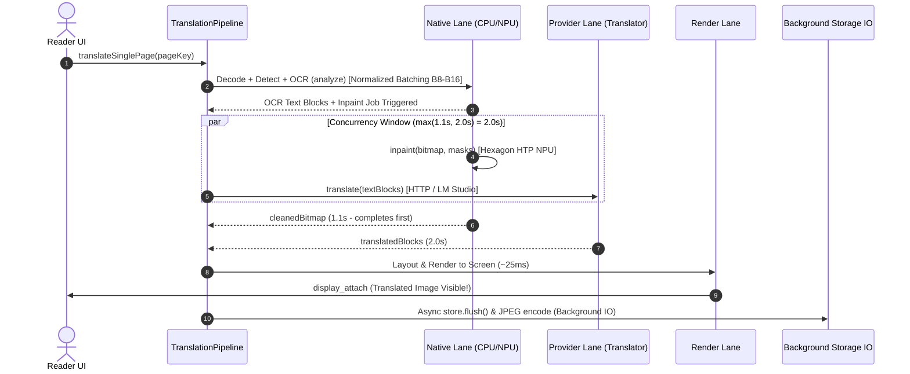

# Architecture Design: Parallel Inpainting & Translation Pipeline + PaddleOCR Batch Governor Optimization

**Date:** 2026-10-09  
**Status:** PROPOSED (Approved by User, Spec Review Phase)  
**Target:** Snapdragon 8 Gen 3 (OnePlus PKG110) & Android Translation Pipeline  

---

## 1. Problem Statement & Motivation

During on-device performance profiling of single-page translation, the observed end-to-end page delivery latency was **6.6 seconds** on moderate pages (6 dialogue blocks) and **10.2 seconds** on dense pages (11 blocks, 30 text leaves).

Detailed stage tracing and disassembled bytecode revealed that although OCR was successfully accelerated to ~0.9s – 2.5s via ARM NEON FP32 XNNPACK, the remaining time is dominated by three serialization and synchronization bottlenecks:

1. **Serialized Inpaint & Translation (+1.2s – 1.5s)**:
   * In [`SinglePageOnnxPhase.kt`](file:///C:/Users/User/Documents/TachiyomiAT-1.16.8-dev/TachiyomiAT-1.16.8-dev/TachiyomiATVibe/app/src/main/java/eu/kanade/translation/pipeline/SinglePageOnnxPhase.kt), `translateSinglePageOnnx` runs inside the `withNativeLane` permit block.
   * Although `inpaintJob` was wrapped in `async`, `processSinglePage` called suspending state updates (`updatePageFromCurrentSnapshot`) and post-OCR metadata updates before returning, causing the calling worker thread to run inpainting synchronously.
   * Consequently, [`SinglePageHttpRenderPhase.kt`](file:///C:/Users/User/Documents/TachiyomiAT-1.16.8-dev/TachiyomiAT-1.16.8-dev/TachiyomiATVibe/app/src/main/java/eu/kanade/translation/pipeline/SinglePageHttpRenderPhase.kt) was not entered until inpainting had completely finished.
   * However, inpainting (running on Snapdragon HTP NPU) and translation (running via HTTP / LM Studio in the provider lane) **share no data dependencies**. Inpainting only needs the bubble mask and original image; translation only needs the OCR string tokens.

2. **PaddleOCR Batch Governor False Downgrades (+1.0s – 1.5s on dense pages)**:
   * In [`PaddleOcrRollingP95HysteresisDowngradePolicy.kt`](file:///C:/Users/User/Documents/TachiyomiAT-1.16.8-dev/TachiyomiAT-1.16.8-dev/TachiyomiATVibe/app/src/main/java/eu/kanade/translation/engines/vision/ocr/paddle/batch/PaddleOcrRollingP95HysteresisDowngradePolicy.kt), `downgradeP95Ms` is hardcoded to `1_000.0` ms.
   * When a multi-leaf batch of 16 crops takes ~1,100 ms (~68 ms per crop, which is highly optimal), the governor treats the *entire batch* as exceeding 1,000 ms, falsely diagnosing latency degradation and throttling batch size down from 8/16 to 4, 2, and then **1**.
   * Running 25–30 crops one-by-one pushed page OCR time up from ~1.5s to 2.5s – 3.7s.

3. **Telemetry Span Placement for `PROVIDER_GOVERNOR_WAIT`**:
   * In [`SinglePageHttpRenderPhase.kt`](file:///C:/Users/User/Documents/TachiyomiAT-1.16.8-dev/TachiyomiAT-1.16.8-dev/TachiyomiATVibe/app/src/main/java/eu/kanade/translation/pipeline/SinglePageHttpRenderPhase.kt), `governorSpan` wrapped pre-flight database updates (`publishLiveStage` and `recordAttemptStart`) instead of solely the actual `governor.acquire()` admission gate, inflating recorded governor wait times.

---

## 2. Design Goals & Non-Goals

### Goals
* **Target Page Latency**: Reduce manual page-turn wait from 6.6s–10.2s down to **2.2s – 3.5s** (a ~60–70% reduction in perceived wait time).
* **True Concurrency**: Run inpainting on Hexagon HTP NPU in parallel with HTTP translation on the network, completely masking the ~1.1s inpaint duration.
* **Prevent Batch Throttling**: Keep PaddleOCR batch sizes at 8–16 across dense pages by normalizing latency evaluation per leaf crop.
* **Maintain Zero Visual Pop-in**: Ensure rendered output contains both clean neural inpainting and translated text before being displayed.
* **Preserve Durability & Memory Safety**: Offload disk flushes to background I/O without blocking user-facing delivery; recycle bitmaps immediately after their respective pipeline stages complete.

### Non-Goals
* Running PaddleOCR SVTR head on NPU/GPU (previously proven unsuitable due to dynamic crop aspect ratios and CTC synchronization stalls).
* Changing batch translation behavior (batch processing already maintains separate lane queues).

---

## 3. Detailed Architecture Changes

### 3.1 PaddleOCR Batch Governor Latency Normalization
* In [`RoiPageRecognitionEngine.kt`](file:///C:/Users/User/Documents/TachiyomiAT-1.16.8-dev/TachiyomiAT-1.16.8-dev/TachiyomiATVibe/app/src/main/java/eu/kanade/translation/engines/vision/ocr/RoiPageRecognitionEngine.kt):
  * When feeding batch execution metrics into `paddleBatchGovernor.record(latencyMs)`, evaluate the **per-leaf latency** (`trace.batchLatencyMs / trace.leafCount.coerceAtLeast(1)`) against a per-crop downgrade budget (e.g. 150.0 ms), OR scale `downgradeP95Ms` by the executed batch size.
  * This prevents multi-leaf batches (e.g., 16 crops in 1,100 ms) from triggering false-positive downshifts to B1.

### 3.2 Decoupled Inpainting & HTTP Translation Handshake
* In [`SinglePageOnnxPhase.kt`](file:///C:/Users/User/Documents/TachiyomiAT-1.16.8-dev/TachiyomiAT-1.16.8-dev/TachiyomiATVibe/app/src/main/java/eu/kanade/translation/pipeline/SinglePageOnnxPhase.kt):
  * Move the `updatePageFromCurrentSnapshot` for inpainting running status inside the `inpaintJob` coroutine itself.
  * Return `Pair(pageTranslation, inpaintJob)` immediately upon OCR completion without yielding/suspending the caller thread.
  * Exit `translateSinglePageOnnx` immediately so `nativePermit` can be released or handed off cleanly.
* In [`SinglePageHttpRenderPhase.kt`](file:///C:/Users/User/Documents/TachiyomiAT-1.16.8-dev/TachiyomiAT-1.16.8-dev/TachiyomiATVibe/app/src/main/java/eu/kanade/translation/pipeline/SinglePageHttpRenderPhase.kt):
  * Start `runTranslate(pageTranslation)` immediately on `Dispatchers.IO`.
  * Only after `runTranslate()` completes does the pipeline call `inpaintJob?.await()`.
  * Since HTTP network translation takes ~1.8s – 2.6s and inpainting on Hexagon HTP takes ~1.1s, inpainting is completely finished by the time the network responds.

### 3.3 Accurate `PROVIDER_GOVERNOR_WAIT` Telemetry Placement
* In [`SinglePageHttpRenderPhase.kt`](file:///C:/Users/User/Documents/TachiyomiAT-1.16.8-dev/TachiyomiAT-1.16.8-dev/TachiyomiATVibe/app/src/main/java/eu/kanade/translation/pipeline/SinglePageHttpRenderPhase.kt):
  * Move `TranslationTrace.beginStage(TranslationTraceStage.PROVIDER_GOVERNOR_WAIT)` so it directly wraps only `governor.acquire()`.
  * Ensure pre-flight database writes (`publishLiveStage` and `store.recordAttemptStart`) are not falsely measured as provider wait time.

---

## 4. Memory Footprint & Lifecycle Safeguards

* **RAM Usage**:
  * During the ~2.0s concurrent window, the input bitmap, inpaint intermediate buffers, and translation response exist in memory.
  * Peak footprint for 1600x2400 ARGB_8888 bitmap:
    $$2 \times (1600 \times 2400 \times 4\text{ bytes}) \approx 30.7\text{ MB}$$
  * Perfectly safe on modern 6 GB – 16 GB Android devices.
* **Bitmap Lifecycle & Recycling**:
  * Decoded source bitmap is recycled immediately upon inpainting completion inside `finally { bitmap.recycle() }`.
  * Output `cleanedBitmap` is passed to the renderer, drawn onto canvas, and recycled immediately after display attach.
  * Cancellation or failure triggers guaranteed recycling of both bitmaps.

---

## 5. Verification Plan

1. **Unit & Regression Testing**:
   * Run `./gradlew testDevDebugUnitTest --tests "eu.kanade.translation.engines.vision.ocr.paddle.batch.*"` to verify the governor respects normalized per-leaf latency and does not falsely downshift.
2. **On-Device Profile Verification**:
   * Build and deploy `app-dev-arm64-v8a-debug.apk` to OnePlus PKG110.
   * Run [`scripts/trace_stream.ps1`](file:///C:/Users/User/Documents/TachiyomiAT-1.16.8-dev/TachiyomiAT-1.16.8-dev/TachiyomiATVibe/scripts/trace_stream.ps1) and verify:
     * Inpaint (`lane=native stage=inpaint`) and Translate (`lane=provider stage=translate`) start timestamps overlap.
     * PaddleOCR batch governor holds at B8 or B16 without downgrading to B1 on dense pages.
     * End-to-end wall clock latency drops to **~2.5s – 3.5s**.
