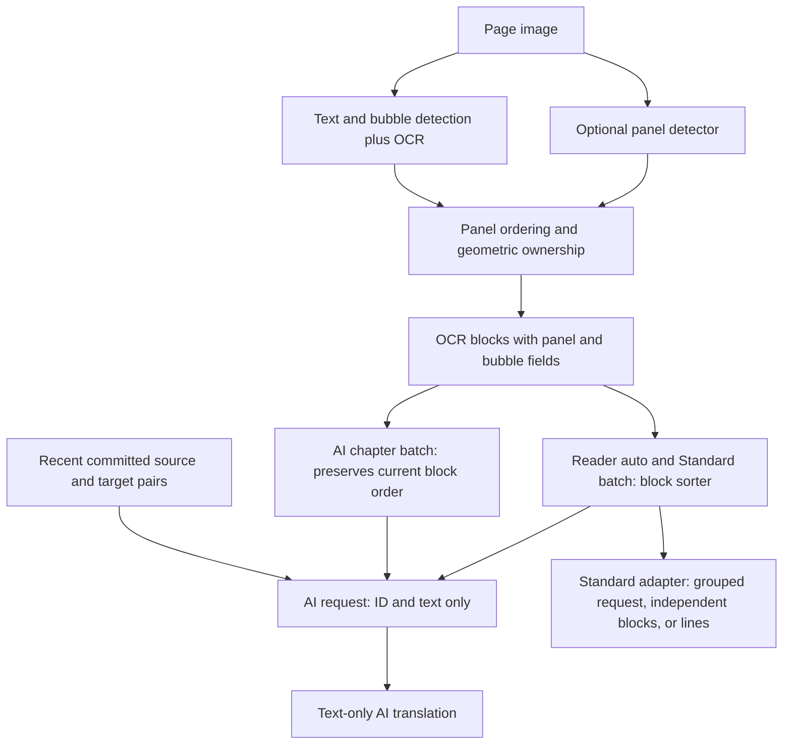

# Translation input quality improvement plan

Added to `main` on 2026-10-05. Audit baseline: `a4e1733` (2026-10-04).

This document brings the Standard/AI translation audit and proposed improvement sequence into the repository. The phases below are proposed work, not completed features. Reading-order semantics, request metadata, utterance grouping, and page atomicity remain subject to coordinator decisions before implementation. Follow one ticket = one branch = one diff for subsequent implementation; never push.

## Phases and acceptance criteria

| Phase | Proposed work | Evidence required before completion |
| --- | --- | --- |
| 1 | Unify AI request reading order across reader and chapter batch; make AI instructions target-language aware | Fresh-OCR reader/batch cases use the same explicit reading sequence without renaming durable IDs; a non-English target has no contradictory English instructions/examples |
| 2 | Retain sliding-window provenance and restrict seam stitching to verified fragment candidates | True seam fragments remain unified; separate adjacent bubbles/text boxes remain separate, including same-window objects |
| 3 | Group fragments into utterances; supply compact input-only panel/bubble metadata; resolve page-level text and vertical ordering | Explicit unknown ownership; stable output-ID mapping; regression cases for opening captions, overlapping vertical bubbles, and fragmented utterances; no assumed speaker identity from panel membership |
| 4 | Improve Standard translation units and context adapters | Whole-utterance ML Kit input; bounded surrounding source content in DeepL context; Google grouped/fallback evaluation; preserved result alignment |
| 5 | Evaluate visual context, verified terminology, scene-aware history, and long-strip chunking | Layout/target/provider-stratified benchmark results, semantic error counts, exact-ID coverage, latency, memory, and token costs; explicit decision before changing page atomicity |

Behavior changes require red-test-first verification. Use filtered checks appropriate to each ticket; full-suite gates remain coordinator-owned. Existing ordering contracts must be deliberately revised rather than silently changed. Adding metadata does not imply replacing the current output protocol.

## Audit baseline

Audited 2026-10-04 against `main` at `a4e1733`, in the main TachiyomiATVibe workspace. This is an audit and proposed improvement order, not an approved implementation contract.

**The panel detector is a useful foundation, but much of the structure it discovers never reaches translation.** Reader automatic AI translation gets sorted text plus recent translated pairs. The current AI chapter-batch path does not run that same panel-aware block sorter. Every AI provider ultimately receives plain `ID|text` lines, without panel/bubble membership, assignment uncertainty, text role, or images. Standard adapters consume still less shared context, with material differences between providers.

My subjective engineering rating of **input preparation** is approximately **6/10 for reader AI automatic translation**, **5/10 for AI chapter-batch and webtoon preparation**, and **3–5/10 for Standard context preparation**, depending on the adapter. These are judgments about available context and confirmed weaknesses, not measured translation accuracy, detector precision, or rankings of the language models. Actual linguistic quality cannot be assigned an honest score from code alone.

## What actually reaches each engine

| Path | Translation unit and ordering | Context supplied | Main limitation |
| --- | --- | --- | --- |
| Reader automatic/manual AI | Current page's nonblank OCR blocks; panel-aware sort then coordinate sort | Recent committed source/target pairs; ID/text lines | Panel/bubble identity and uncertainty disappear at serialization |
| AI chapter batch | Whole-page envelopes; page order is preserved, block order follows current OCR/store order | Recent committed source/target pairs; stable page/block IDs | Current dispatch bypasses the reader/Standard batch block sorter |
| Google Standard | Page blocks wrapped in HTML spans and packed up to 5,000 source characters; serial per-block fallback if reconstruction fails | Other text in the same grouped request is available to the provider; no explicit structural metadata or rolling history | Grouped request is not a proven speaker/context contract; fallback removes neighboring text |
| DeepL Standard | Repeated `text` fields, one per OCR block | No `context` field | Batching preserves result association, but separate items do not share context |
| ML Kit Standard | Each newline within each OCR block is translated separately | No neighboring blocks or preceding lines | Visual line breaks can split one sentence into independent translation calls |

AI providers traced: Gemini, DeepSeek, OpenRouter, and LM Studio. The three OpenAI-compatible adapters share `parseContextualCompletion`; Gemini uses the same request builder and system prompt. None of these translation payloads includes an image. Separate structured-analysis code is not evidence of richer context in the live translation request.

Recent history is bounded to **32 source/target pairs**, then token-trimmed to **1,500 tokens**, or **512 for LM Studio**. It comes from committed chapter state before the current request. Missing/uncommitted predecessor output cannot contribute continuity. Current requests have an 8,192-token planner ceiling. The live chapter-batch configuration defaults to **64 blocks / five pages**, with additional token limits; do not confuse this with the pure planner class's smaller fallback defaults.



## Findings, in priority order

### 1. High: AI chapter-batch does not obtain the panel-aware block ordering used by the reader

The live AI batch dispatch selects the profile pipeline instead of the Standard translator worker. `ChapterProfileBatchCoordinator` enumerates `effectivePage.blocks` in store order when constructing dispatch work. `ProfileEnvelopeExecutor` again enumerates `page.livePage.blocks` in that same order when making the actual contextual chunk. Neither invokes `TranslationBlockSorter`. OCR panel assignment sets metadata but does not reorder the final block list.

Fresh OCR order is detector/recognizer insertion order; for tall images the merged detections are initially arranged by score. Consequently, sorting panel bounding boxes and assigning `panelIndex` does **not** guarantee that the AI sees dialogues in panel order in this lane. A page inherited from previously sorted reader state can conceal the problem.

Evidence: [AI batch dispatch](../app/src/main/java/eu/kanade/translation/pipeline/batch/BatchChapterTranslator.kt), [planning block iteration](../app/src/main/java/eu/kanade/translation/pipeline/batch/ChapterProfileBatchCoordinator.kt), [actual request block iteration](../app/src/main/java/eu/kanade/translation/pipeline/batch/envelope/ProfileEnvelopeExecutor.kt), [reader sort](../app/src/main/java/eu/kanade/translation/pipeline/SinglePageHttpRenderPhase.kt).

**Improvement:** define one explicit ordering step for request construction across lanes. Preserve durable block identity and map request order back to the original block locations; do not renumber blocks after sorting. This needs a fresh-OCR AI batch regression case, not only pure sorter tests.

### 2. High: webtoon seam merging can combine distinct text regions or bubbles

`mergeDetections` merges same-label boxes when they share at least 60% of the smaller horizontal span and have any vertical overlap, or a vertical gap of at most 20 pixels. The routine has no window ID or seam location. It therefore applies its seam rule to detections from the same window and to distinct nearby objects away from a seam. Union boxes can grow and absorb additional objects.

**Reproduced:** two distinct label-1 boxes `[100,100,200,150]` and `[100,160,200,210]` become one `[100,100,200,210]` box. They have zero intersection and a 10-pixel gap. If these are different utterances, grouping them before OCR changes the unit the translator sees. This affects both engine categories.

Evidence: [merge condition](../app/src/main/java/eu/kanade/translation/engines/vision/webtoon/WebtoonSlidingDetector.kt).

**Improvement:** retain detection-window provenance and restrict fragment stitching to verified adjacent-window seam candidates. Distinguish overlapping duplicate detections from fragments of one region. Include a negative case for two different nearby bubbles and text boxes. Merely changing the gap constant is insufficient.

### 3. High for non-English targets: shared AI instructions contradict the selected target

The system prompt names `${to.label}` but unconditionally asks for natural spoken **comic English**, and its only output examples are English. This is conflicting guidance when the user selects French or another target. It does not prove every model returns English; it creates an avoidable bias across all four AI providers.

**Reproduced:** Japanese → French still contains the comic-English instruction.

Evidence: [shared system prompt](../app/src/main/java/eu/kanade/translation/engines/translator/contextual/TranslationPrompts.kt).

**Improvement:** make localization instructions target-aware and remove English-only examples for other targets. Retain tone without inviting extra content. Evaluate languages separately; shorter prompts are preferable to unnecessary example machinery.

### 4. High opportunity: detected panel/bubble structure is absent from the AI input

`TranslationPrompts.idMappedSourceLine` emits only `ID|flattened source`. The request builder passes these lines directly to all AI translators. `panelIndex`, `bubbleIndex`, `panelAssignment`, and `panelContainment` do not appear. Page boundaries in batch are implicit in `pN_bM`; panel/bubble boundaries are not represented at all. The text-only model cannot distinguish dialogue, narration, or SFX from detector/parent metadata.

**Reproduced:** a block with confident panel 2 ownership and bubble 3 becomes exactly `p0_b0|source`.

Evidence: [source serialization](../app/src/main/java/eu/kanade/translation/engines/translator/contextual/TranslationPrompts.kt), [contextual request construction](../app/src/main/java/eu/kanade/translation/engines/translator/contextual/ContextualRequestBuilder.kt).

This plain format is explicitly pinned by current tests; restoring structural context would be a contract change, not a mechanical bug fix. Existing comments claiming that prompts expose panel uncertainty are inaccurate for this revision.

**Improvement:** add compact, input-only structural context keyed by existing stable IDs. Keep the output `ID|translation` contract simple. Represent unknown panel/speaker information as unknown. Same panel does **not** mean same speaker, and geometric containment is not a calibrated probability that ownership is correct. Bubble IDs provide utterance grouping, not character identity.

Illustrative request shape, not a settled schema:

```text
PAGE p12; layout=rtl_manga
STRUCTURE p12_b0: panel=0; bubble=0; ownership=owned
STRUCTURE p12_b1: panel=0; bubble=0; ownership=owned
STRUCTURE p12_b2: panel=unknown; bubble=unknown; ownership=spanning
SOURCE (translate these IDs only):
p12_b0|...
p12_b1|...
p12_b2|...
```

### 5. Medium–high: ordering heuristics can misplace narrative text and split one utterance

The sorter puts every unassigned block after all owned panels, regardless of original location. The existing test deliberately pins that policy. An opening caption above the first panel consequently becomes the last text in the prompt. Uncertain ownership should not automatically imply last in narrative order.

Within a group, **any** vertical overlap puts blocks into one row; horizontal position then wins. For a vertical webtoon this can reverse two sequential bubbles. The sorter also does not use bubble identity to keep fragments of the same utterance together.

**Reproduced:**

| Input | Actual current result |
| --- | --- |
| Opening unassigned caption at y=0, owned dialogue at y=100 | Dialogue, caption |
| Upper LTR block at x=500,y=0,h=100; lower at x=100,y=90,h=100 | Lower, upper |
| Bubble A fragment 1 at y=0, bubble B at y=20, bubble A fragment 2 at y=40 | A1, B, A2 |

Evidence: [trailing unassigned group](../app/src/main/java/eu/kanade/translation/engines/vision/ocr/TranslationBlockSorter.kt), [row grouping](../app/src/main/java/eu/kanade/translation/engines/vision/ocr/TranslationBlockSorter.kt).

**Improvement:** distinguish request reading sequence from panel ownership. Use explicit layout profiles for RTL manga, LTR comics, and vertical scroll, with bubble/utterance grouping before inter-bubble ordering. Preserve source/block mapping. Handle page-level text in plausible narrative position while keeping its ownership uncertain. Do not join different bubbles solely because they share a panel.

### 6. Medium: Standard engines do not consistently translate whole utterances with neighboring context

DeepL emits only source/target language and repeated text fields. Its official API documentation states that array items are translated independently. The available `context` parameter is not used. ML Kit splits one OCR block at every newline and submits each line separately. Those newlines can be OCR layout breaks inside one sentence.

Google is the exception: it attempts a shared HTML request, retaining IDs through spans. That is useful, but supplies no panel/bubble grouping, and malformed reconstruction causes a serial per-block fallback. Shared batching should not be described as guaranteed discourse understanding.

Evidence: [DeepL request](../app/src/main/java/eu/kanade/translation/engines/translator/providers/DeepLTranslator.kt), [ML Kit line splitting](../app/src/main/java/eu/kanade/translation/engines/translator/providers/MLKitTranslator.kt), [Google grouped request](../app/src/main/java/eu/kanade/translation/engines/translator/providers/GoogleTranslator.kt), [DeepL API semantics](https://developers.deepl.com/api-reference/translate/request-translation).

**Improvement:** use complete utterances as input units. Normalize visual line breaks in a language-aware way; preserve real sentence boundaries. For DeepL, provide relevant surrounding **source content** through `context`, bounded to scene/page/neighbor scope. Do not copy LLM instructions or the mixed source/target rolling-history prompt into that field: [DeepL's guide](https://developers.deepl.com/docs/learning-how-tos/examples-and-guides/how-to-use-context-parameter) explicitly distinguishes surrounding content from commands. Maintain provider-specific result alignment.

### 7. Medium: the panel model is not a universal manga/webtoon context layer

Panel detection is bypassed for images with height/width ≥2, Korean sources, and any resolved LTR reading direction. This includes ordinary LTR comics and Chinese in AUTO mode, not only webtoons. `assignBubbleIndices` is also behind `panelDetector ?: return`, so explicit bubble indices depend on loading the optional panel model even though parent-bubble geometry exists independently.

Evidence: [bypass and bubble-index dependency](../app/src/main/java/eu/kanade/translation/engines/vision/ocr/RoiPageRecognitionEngine.kt).

The [upstream model card](https://huggingface.co/leoxs22/manga-panel-detector-yolo26n) describes 640×640 training on Manga109-s and reports strong panel detection results for its INT8 **TFLite** model. Those figures do not validate our ONNX export, our 0.5 confidence threshold, reading order, speaker assignment, or webtoon/colored-comic quality. The app drops detector confidence after accepting a panel and assigns by maximum geometric containment; ambiguous competing panel candidates are not separately exposed.

**Improvement:** keep the current model as one layout hint and benchmark the exact deployed ONNX export. Decouple bubble grouping from panel-model availability. Resolve reading direction and scroll layout independently of source language. Add layout-specific fallback grouping; evaluate sliced panel detection only where it improves ordering, with cross-slice identity handling. Do not blindly run the full tall strip through a 640×640 detector or lower thresholds without evidence.

## Other opportunities and strengths

| Area | Assessment / next experiment |
| --- | --- |
| Recent history | Already valuable for AI. Its bounded, unlabelled pairs lack durable name/character identity and scene boundaries. A mistranslation can seed later choices. Test bounded verified terminology and explicit scene reset/context selection before adding a large analysis pipeline. |
| Retry context | Reader partial retries send only missing blocks; completed sibling dialogue from the same page is not included. Retain full-page source/sibling context as read-only material while requesting output only for missing IDs. Evidence: `SinglePageHttpRenderPhase.kt:537`. |
| Very long webtoon files | Whole-page atomic planners reject images whose text exceeds a request budget; chapter batch also enforces the live structural cap. Evaluate semantic sub-page chunks with overlap and stable block mapping. This changes the current atomicity contract and needs an explicit decision. |
| Visual meaning | No translation request sees the art. Text and panel IDs cannot establish who points at an object, a visual joke, or who is speaking. Test an optional vision-capable path using page/scene crops plus anchored OCR; route ambiguous cases, rather than every request, if cost/latency matter. |
| IDs and validation | Stable batch IDs, strict cardinality checks, typed failures, and observable partial outcomes are good foundations. Retain these while improving inputs. |
| Semantic quality | `TranslationBlockValidation` checks completeness/non-echo, not correct target language, pronouns, names, missing meaning, or fluent dialogue. Structurally valid text can be wrong. Advisory/refusal logic is not a semantic quality benchmark. |
| Conservative ownership | Optional detection and uncertain assignment categories avoid forced nearest-panel ownership. Keep this direction, but make uncertainty available to request construction. |

The recommendation to test visual context is supported by [COLING 2025 manga translation research](https://aclanthology.org/2025.coling-main.232/), which evaluates visual context, translation unit size, and context length. It supports running those experiments; it does not predict a numerical gain for this app or guarantee that every larger/multimodal request wins.

## Implementation sequence

1. Fix cross-lane request ordering and the non-English prompt contradiction. Add focused regression tests and prove behavior before changing it.
2. Correct webtoon seam merging; retain window provenance and negative examples for distinct adjacent objects.
3. Add bubble/utterance grouping and compact structural metadata for AI, with stable output mapping and explicit unknowns. Resolve the trailing-caption/vertical ordering policy with the coordinator.
4. Improve Standard units: whole utterance for ML Kit; surrounding source context for DeepL; evaluate Google's grouped/fallback behavior.
5. Benchmark optional vision, bounded verified terminology, scene-aware history, and semantic sub-page chunks. Choose an alternate detector only after the exact-model/layout benchmark identifies detection as the bottleneck.

## How to obtain a real quality rating

Use a first evaluation set of **120 representative pages/segments**: 30 RTL manga, 30 vertical webtoon segments, 30 LTR comics/manhua, and 30 difficult cases (borderless panels, SFX, narration, fragmented utterances, page seams). Include multiple titles per stratum and multiple target languages, including a non-English target. Long strips must remain represented at original-file scale for the budget/merge checks.

Run two complementary tracks:

| Track | What stays fixed | What it isolates |
| --- | --- | --- |
| Input/translation ablation | Corrected OCR, fixed provider/model/settings | Current format versus ordered format, bubble metadata, surrounding context, optional images |
| Full automatic pipeline | Original image inputs and deployed vision stack | Detector misses, OCR errors, grouping, ordering, budgets, and resulting translation quality |

Measure source coverage, ordering mistakes, accidental utterance merges, wrong speaker/pronoun/name choices, adequacy/faithfulness, fluency, wrong-target-language output, and exact ID mapping. Include request failures, latency, memory, and token use. Report results per layout, target language, and engine. Use blind bilingual judgment with a concrete error rubric; automatic lexical metrics alone cannot settle comic dialogue quality. Compare configurations with the same OCR/model first so an improvement is attributable to request preparation.

## Original audit verification (2026-10-04)

| Phase | Result |
| --- | --- |
| Source tracing | Reader automatic/manual, AI chapter-batch, Standard batch; four AI providers and three Standard adapters |
| Focused executable characterization | **6 declared / 6 executed / 6 observed as expected**, using four unchanged production Kotlin algorithm files and minimal data/Android stubs |
| Application test suite / ONNX/device inference / paid provider calls | **0**; no claim of end-to-end measured translation quality |
| Production edits / commits / pushes | **0 / 0 / 0** |

The six probes verify current behavior, including undesirable behavior. Their passing does not mean the translation pipeline passed a quality gate. They were compiled directly with the cached Kotlin compiler and run with the Android Studio JBR, without Gradle. No application test counts changed; XML parity arithmetic is inapplicable to these standalone probes.

The original audit retained a standalone Kotlin characterization harness outside the repository; it is not bundled with this documentation. The probes exercise geometry and prompt serialization, not image/OCR/model accuracy or the live coordinator itself. The chapter-batch ordering finding is validated by call-path inspection and merits an integration regression test.
