# Android pipeline architecture for 100–200 page MangaOCR workloads

Date: 2026-09-18  
Scope: architecture/evidence only; no Android application code was changed.  
Repository revision inspected: `9c19ad05bd62cc3c222dfa8527fd4407b037ecc6`.

## Executive recommendation

Use one process-wide, durable page-work queue and one bounded native-compute
admission gate. Keep manual, reader-auto, and chapter-batch requests in the
same queue, but give them different priorities and cancellation ownership.
Only dispatch a page when its source/configuration fingerprint and stage
checkpoint are current. The native path should stream one page (or a small
ROI microbatch) at a time, persist OCR/inpaint artifacts, release decoded
memory, and let translation/network work overlap the next native page.

Recommended initial policy:

| Work origin | Initial OCR microbatch | Scheduling policy | Confidence |
|---|---:|---|---|
| Manual selected page | B=1 | strict interactive priority; cancel/defer background work between native invocations | INFERRED |
| Reader auto window | B=2, experimentally B=4 | visible page first, then bounded ahead window; aging prevents starvation | INFERRED |
| Chapter batch | B=4, experimentally B=8 | lowest priority, persistent and resumable | INFERRED |

The B values above are starting hypotheses, not Android defaults. The checked-in
desktop lab shows exact B=1 token equivalence and useful dispatch reduction, but
does not measure Android latency, thermal behavior, native memory, or full-page
pipeline throughput. B=2 is the safest first experiment because it had the
lowest measured peak-RSS increase among the tested batched modes. Normal manga
must continue using the existing B=1/serial path unless the model graph gate,
quality corpus, and device tests pass.

## Evidence summary

The repository already contains most of the safety boundaries needed for this
design:

| Claim | Evidence label | Evidence |
|---|---|---|
| Native ONNX work is serialized and cancellation is quarantined until the real native call exits. | **OBSERVED** | `app/.../pipeline/EngineLane.kt`, `app/.../scheduling/NativeRunQuarantine.kt`, and `RoiPageRecognitionEngine.nativeGuard`. |
| OCR and inpaint use pooled direct buffers/bitmaps and expose explicit reclaim hooks. | **OBSERVED** | `MangaOcrEngine.kt`, `PaddleOcrV6SmallEngine.kt`, `PaddleOcrV6DetEngine.kt`, `BitmapPool`, `DirectBufferPool`, `PageRecognitionEngine.reclaimPooledMemory()`. |
| The current Android `recognizeBatch()` is sequential map-over-recognize, not true graph batching. | **OBSERVED** | `app/.../ocr/RoiOcrEngine.kt`; `MangaOcrEngine.recognizeBatch()` delegates to `crops.map { recognize(it) }`. |
| The current page recognition path creates ROI bitmaps, OCRs them, and recycles them after each page. | **OBSERVED** | `RoiPageRecognitionEngine.analyze()`; native-vertical path builds a crop list and recycles all crops, Paddle path creates padded/unpadded crops per detection. |
| The native/remote handoff is already split: `prepareSinglePage()` durably prepares OCR/inpaint, while `translatePreparedPage()` runs outside the native permit. | **OBSERVED** | `TranslationExecutor.kt` contract and `TranslationPipeline.kt`. |
| Batch has a bounded held-bitmap registry (4 entries and 48 MiB ceiling). | **OBSERVED** | `pipeline/batch/HeldBitmapRegistry.kt`. |
| A true microbatch prototype passed B=1 equivalence and all tested batch sizes matched 32/32 crops. | **OBSERVED** | `tools/mangaocr_lab`, run `2026-09-18 03:27 UTC`, JSON under ignored `tools/mangaocr_lab/results/20260918-032700-b1_2_4_8/run.json`. |
| Desktop timing and RSS transfer directly to Android. | **UNVERIFIED / CONTRADICTED** | The lab explicitly labels timings desktop-only; Android ARM/native memory/thermal measurements are absent. |
| A 100–200 page chapter can complete within a particular wall-clock target. | **UNVERIFIED** | No full-page Android benchmark was found. |

Model payload evidence: the checked-in MangaOCR assets are approximately 64.8
MB on disk (`encoder.onnx` 17,070,003 bytes, `decoder_init.onnx` 24,875,052,
`decoder_step.onnx` 22,776,797, `vocab.txt` 37,193). This is model-file size,
not a runtime-RSS estimate; ORT arenas, KV caches, decoded pages, and temporary
arrays are additional.

## Proposed component topology

```mermaid
flowchart LR
    U[Manual / reader auto / chapter batch] --> Q[Durable global page queue]
    Q --> P[Priority + fairness planner]
    P --> D[Decode one page into bounded slot]
    D --> N[Native admission gate]
    N --> X[Detect / segment / panel context]
    X --> R[ROI extraction or tensor view]
    R --> O[OCR B=1..8 by compatible group]
    O --> C[Atomic OCR checkpoint]
    C --> I[Inpaint / cleaned-image checkpoint]
    I --> T[Translation / provider lane]
    T --> L[Layout + render + commit]
    L --> F[Durable final state]
    T -. overlaps .-> N
    C -. release bitmap .-> M[Pool + memory governor]
    D -. pressure .-> M
    M -. throttle / downgrade / pause .-> P
```



The dotted overlap is intentional: page N's translation request can wait on
network while page N+1 occupies the native lane. In the existing contract,
inpaint belongs to the preparation boundary and must finish before the remote
translation handoff; moving inpaint after translation would be a separate,
unverified storage/render contract change.

### Queue identity and admission

Each queue record should contain:

```text
WorkId = (sourceId, mangaId, chapterId, pageIndex, storageKey)
sourceFingerprint
ocrModel + translator/inpaint configuration fingerprint
generation / pageVersion
origin = MANUAL | AUTO | BATCH
priority, enqueueTime, cancellationEpoch
stage = QUEUED | DECODING | NATIVE | OCR_READY | INPAINT_READY |
        TRANSLATING | RENDERING | PAUSED | FAILED | COMPLETE
```

The durable key must remain page identity, not a decoded bitmap or a reader
position. A stale result must be rejected by generation/page-version and
fingerprint checks before publication. Existing `TranslationSession`,
`TranslationPageId`, `ChapterTranslationStore`, `PageStageLeaseTable`, and
`TranslationQueueStore` are suitable seams; the new global planner should
compose them rather than create a second artifact authority.

The planner should group only compatible OCR requests: same model, language,
preprocessing revision, and execution provider. Never mix pages whose model or
content fingerprint differs merely to fill B. A partial final group uses its
true size; do not pad with fake pages.

## Priority and scheduling

Use a single priority queue plus aging, not independent manual/auto/batch
workers competing for the native lock. A practical ordering is:

1. Manual selected page (B=1, immediate next admission).
2. Auto visible page, then the smallest ahead distance.
3. Recovery/retry of a page whose durable checkpoint is already available.
4. Chapter batch pages in chapter order.

Every item gets a monotonic enqueue sequence for stable ties. After a bounded
interactive burst (for example, a small number of native admissions), allow one
eligible batch item; the exact burst limit is **UNVERIFIED** and must be tuned
with a reader-latency trace. Aging raises a waiting batch item gradually so a
reader who keeps scrolling cannot starve a 200-page job forever. Manual should
win over auto for the same page, but must attach to an existing owner rather
than start duplicate OCR.

Do not create one native worker per chapter. The existing queue investigation
found only one chapter worker is selected globally and that some single-chapter
admission paths can evict same-source queued work; a new planner should make
append/replace explicit and preserve accepted queue intent.

## Stage overlap and ownership

The safe overlap is between resource classes, not arbitrary concurrent ONNX
calls:

| Stage | Resource/ownership | Lifetime rule |
|---|---|---|
| Decode | bounded bitmap slot, IO dispatcher | release or transfer one owner; never retain a chapter of bitmaps |
| Detect/segment/panel | native gate | one session owner; `nativeGuard` prevents close/use-after-free |
| Crop/tensor preparation | bitmap/direct-buffer pools | prefer direct tensor staging; recycle in `finally` |
| OCR | same native gate; microbatch within a compatible group | B is ROI rows, not page workers; decoder lockstep must be respected |
| OCR checkpoint | artifact store | publish before releasing identity; downstream stages see a versioned snapshot |
| Inpaint | native gate and cleaned-image file | persist revision/fingerprint before handoff |
| Translation | provider/network lane | may overlap next page's native work; obey shared request governor |
| Layout/render | render lane and artifact lease | commit only if generation/page version still matches |

The current `RoiPageRecognitionEngine.analyze()` holds `nativeGuard` across
detect, optional segmentation, and the OCR loop. This is conservative and
safe, but means page-level native concurrency is not currently available. A
global queue can still improve throughput by overlapping remote translation
with the next native page. True concurrent detector/OCR/inpaint sessions are a
future device-specific optimization and should not be inferred from the queue
design.

## MangaOCR microbatch evidence and implications

The host lab used the checked-in four model assets, an Android-like ORT session
profile, 32 fixture ROIs, and a B=1 equivalence gate. All batched runs matched
reference tokens and text 32/32:

| B | Encoder runs | Init runs | Decoder-step runs | Step dispatch change | Total wall time | Peak process RSS |
|---:|---:|---:|---:|---:|---:|---:|
| 1 | 32 | 32 | 625 | baseline | 7,635 ms | 322.6 MB |
| 2 | 16 | 16 | 446 | -29% | 6,711 ms | 353.2 MB |
| 4 | 8 | 8 | 292 | -53% | 7,068 ms | 412.1 MB |
| 8 | 4 | 4 | 152 | -76% | 6,476 ms | 530.3 MB |

**OBSERVED:** B=2/4/8 all matched 32/32 reference outputs.  
**OBSERVED:** B=2 had the smallest RSS increase (+30.6 MB) and the best
measured wall time among B=2/4 in this run; B=8 had the lowest host wall time
but 530.3 MB peak RSS.  
**INFERRED:** B=2 is the first Android experiment; B=4 is a bounded high-memory
option; B=8 should be opt-in until native RSS and thermal measurements exist.

Important implementation constraints from `tools/mangaocr_lab/lab/state.py`:

- decoder position is a scalar broadcast to all rows;
- all rows step in lockstep;
- finished rows receive EOS filler and their outputs are discarded;
- the group stops at the shared position ceiling (127/128 boundary).

This means B cannot be treated like independent asynchronous decoder jobs. Long
or difficult ROIs make short rows wait, so a production scheduler should group
roughly similar crop aspect/length where possible, while preserving page order
and never changing the OCR identity. The grouping optimization is **UNVERIFIED**.

The current Android `recognizeBatch()` does not implement this state machine;
it simply invokes `recognize()` once per crop. Porting the lab state machine to
Kotlin requires a separate model-graph/runtime gate and should be feature-gated.

## Cancellation, pause, and resume

Cancellation must be cooperative and stage-aware:

1. Remove queued work immediately and increment its cancellation epoch.
2. For a running native call, request cancellation but do not close an ORT
   session or drain a native buffer while `nativeGuard` is held.
3. Let `NativeRunQuarantine` await the actual native invocation exit.
4. Mark the page `PAUSED`/`CANCELED` in a `NonCancellable` finalizer only if
   the generation is still current.
5. Keep already-committed OCR/inpaint/translation artifacts reusable.

Checkpoint after each durable boundary, at minimum:

```text
source bytes/fingerprint -> decoded source identity
detector/segmenter revision -> OCR blocks + block IDs + OCR fingerprint
inpaint revision/mask fingerprint -> cleaned image name
translator/provider fingerprint -> per-block translation status
render revision -> committed display artifact
```

Resume starts at the first invalid stage, not at page 1 and not at the reader's
current position. A content/config/model fingerprint mismatch invalidates that
stage and all downstream stages while retaining the prior committed display for
truthful UI. Retry and resume must be idempotent: a second commit with the same
generation and fingerprint is a no-op, while a stale generation is rejected.

The existing batch resume planner, write gate, page leases, and artifact
generation checks are strong foundations. Preserve the distinction between
candidate work and committed display; a canceled candidate must not erase the
last good page shown in the reader.

## Memory, bitmap, and thermal policy

### Memory

- Bound decoded full-page slots to the number of native stages actually in
  flight; start with one native bitmap plus one translation handoff reference.
- Store page bytes and cleaned images on disk. A 100–200 page run must never
  retain all decoded pages.
- Replace `Bitmap.createBitmap` ROI churn where feasible with a pooled tensor
  staging path that clips directly from the source into the detector/recognizer
  input. Android `Bitmap` has no zero-copy crop view, so a truly zero-copy path
  is **UNVERIFIED**; direct tensor staging is the realistic target.
- Keep `BitmapPool`, `DirectBufferPool`, scratch arrays, and held-cleaned-image
  registry separately metered. Release every crop/result/tensor in `finally`.
- Apply both byte and count limits. The existing 4-entry/48 MiB held-bitmap
  limit is a useful safety precedent, not a proof that it is correct for every
  device.
- Before decode/analyze/inpaint, consult `TranslationMemoryBudget`. On defer or
  OOM: release bitmap/native pools, force GC only as recovery, downgrade B and
  decode sample size, then retry once. Do not spin indefinitely.

### Thermal and battery

Use a device-health governor sampled at admission and between pages:

| Condition | Policy |
|---|---|
| normal memory/thermal | selected B, one native lane, remote overlap |
| low available heap or repeated reclaim | B=1, smaller decode, no held bitmap |
| moderate thermal pressure | finish current native invocation, reduce batch size and pause chapter batch between pages |
| severe thermal/foreground loss | pause batch, persist checkpoint, retain manual/visible-page priority |

Exact thresholds, Android thermal callbacks, and the cost of model reload are
**UNVERIFIED**. A thermal governor must not unload a live session concurrently;
use the same native ownership boundary as `close()` and `forceReleaseNativeBuffers()`.

## Accelerator routing and fallback

Route by model/stage and record the provider that actually executed, not a global
device preference:

| Stage/model | Current evidence | Proposed policy |
|---|---|---|
| MangaOCR encoder + autoregressive decoder | **OBSERVED** in `MangaOcrEngine.kt`: explicit CPU provider; many tiny decoder graphlets make accelerator dispatch unattractive. | Keep CPU by default. Microbatch only after B=1 gate and Android correctness/RSS tests. |
| Paddle detector/recognizer | **OBSERVED** in source: accelerator requested with fallback and actual provider label captured. Prior device report found dynamic-int8 detector rejection on QNN and CPU medians of 260 ms (text detector) / 121 ms (panel detector). | Keep a one-time CPU fallback for unsupported graph; do not repeatedly rebuild per ROI. Static-QDQ replacement is a future experiment. |
| AOT inpaint | **OBSERVED** in prior T922 device report, scoped to OnePlus Ace 5/Snapdragon 8 Gen 3: HTP median 110 ms vs CPU 4,781 ms; GPU 512 reflect-pad graph failed. | Prefer HTP only after capability probe and context-cache readiness; CPU remains correctness fallback. Do not generalize the numbers to all Android devices. |

Fallback state should be sticky for the current session/model fingerprint after
the first typed accelerator failure. Persist only capability facts that are
safe to reuse; a driver update/device change must invalidate them. Log
registered, attempted, accepted, and proven provider separately.

## Failure modes and invariants

| Failure | Required behavior |
|---|---|
| queue duplicate | attach to current owner; never duplicate paid translation/OCR |
| manual arrives during batch | manual outranks at next safe native boundary; preserve batch checkpoint |
| cancellation during ORT call | quarantine until real exit; no mid-call session close |
| process death | durable queue/artifacts restore as paused/queued; no auto-start promise |
| stale download/page key | fingerprint/generation reject; retain committed display |
| malformed/partial provider response | persist typed retry/paused state; do not advance ordered context |
| OOM | release pools, downgrade B/sample, retry bounded times, expose pause/failure |
| accelerator init/run failure | one typed fallback to CPU, then sticky route for the run |
| batch B group partially completes | commit rows independently only when their stage fence is valid; unfinished rows resume |
| long ROI in lockstep microbatch | cap shared position; record row-level position-limit outcome; do not silently claim EOS |

Normal manga safety invariant: if the feature gate is off, the selected OCR
engine, page order, detection geometry, crop orientation, text filter, and
artifact schema remain unchanged. Batching must never alter vertical-text
handling: `RoiOcrEngine.prefersHorizontalText` still controls Paddle rotation,
while MangaOCR/ML Kit receive native vertical crops.

## Validation plan before implementation

1. **Pure queue tests:** priority ordering, aging, duplicate attachment,
   cancellation epochs, fairness, and manual/auto/batch coexistence.
2. **Checkpoint tests:** crash at every stage boundary; resume from OCR-only,
   inpaint-only, translation-only, and render-only states; stale generation
   rejection; sparse page set.
3. **MangaOCR lab gate:** pristine-vs-derived B=1 exact token equality, numeric
   tolerances, B=2/4/8 output equality, lockstep position-limit behavior, true
   final-group sizing, and no padded fake rows.
4. **Android instrumentation:** same corpus on representative 6 GB+ devices;
   measure per-stage latency, peak Java/native RSS, bitmap bytes, thermal status,
   decoder position-limit rate, and reader input latency.
5. **End-to-end 100/200-page soak:** cancel/resume, process death, chapter
   switch, visible-page takeover, network rate limiting, storage exhaustion,
   and mixed normal manga/manhwa pages.
6. **Fallback matrix:** CPU-only, QNN/HTP supported, accelerator init failure,
   runtime failure, context-cache miss, and thermal downgrade.

Acceptance should compare B=1 vs enabled B on the same images and require no
new OCR text mismatches, missing blocks, stale commits, reader regressions, or
unbounded native memory. The desktop run is a correctness/dispatch gate only;
it is not an Android performance sign-off.

## Open measurements

The following must remain explicit **UNVERIFIED** until device testing:

- Android ARM wall time and energy per ROI for B=1/2/4/8.
- Native RSS and peak bitmap bytes for a 200-page chapter with long webtoon
  images and high block counts.
- Whether B=4/8 improves end-to-end throughput once detector, crop creation,
  inpaint, provider pacing, and disk IO are included.
- Thermal throttling thresholds and whether HTP context compilation cost is
  acceptable on cold start.
- Reader-latency impact of fairness limits and manual preemption.
- Accuracy impact of crop/tensor staging changes and lockstep grouping by ROI
  length/aspect.

## Bottom line

The preferred architecture is a durable global scheduler with a single safe
native lane, small compatible OCR microbatches, per-page checkpoints, and
remote translation overlap. Start with manual B=1 and experiment with auto B=2;
only promote B=4/8 after Android memory/thermal and no-regression evidence.
The existing safety primitives make this incremental, but the true MangaOCR
batch state machine is not yet in the Android engine and must not be treated as
implemented merely because the desktop lab passes.
